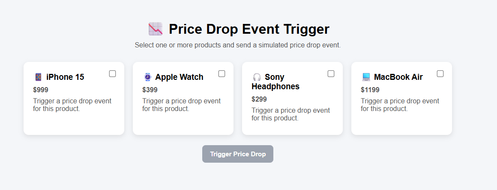

# Web push in Adobe Journey Optimizer

Web push notifications are a powerful way to re-engage users in real time, and this tutorial walks you through implementing them using Adobe Journey Optimizer (AJO). You'll start by using the Web SDK to capture user opt-in preferences for push notifications, ensuring a seamless and compliant subscription experience. Next, you'll create a campaign to send push notifications to users who have opted in, enabling audience-based engagement. Finally, you'll learn how to leverage AEP Tags to trigger a custom price drop event, which initiates a journey in AJO and delivers timely, personalized push notifications based on real-time user behavior.

Sample web page for allowing users to opt in for notifications

Sample web page to trigger price drop event

## Prerequisites

This tutorial is designed to be hands-on and easy to follow. While no deep expertise is required, a basic familiarity with the following concepts will be helpful:

- Adobe Journey Optimizer (creating journeys or campaigns)
- AEP Data Collection (Tags) and the Web SDK
- Basic Adobe Experience Platform concepts like schemas and events
- Some JavaScript and general web development concepts
- Basic Node.js knowledge (for generating VAPID keys and serving a simple config endpoint)

If you're new to any of these areas, don't worry—the tutorial will guide you through the key steps along the way.
This tutorial focuses on implementing an end-to-end web push notification use case, so a working knowledge of the above tools and concepts will help you follow along effectively.

## 🔔 Enable Browser Notifications

If notifications are blocked or not appearing, you may need to enable them in your browser settings. Refer to the guides below:

-   **Google Chrome (Windows/macOS)**  
  <https://support.google.com/chrome/answer/3220216>

-   **Microsoft Edge (Windows)**  
  <https://support.microsoft.com/en-us/microsoft-edge/manage-website-notifications-in-microsoft-edge>

-   **Safari (macOS)**  
  <https://support.apple.com/guide/safari/customize-website-notifications-sfri40734/mac>

-   **Safari (iPhone/iPad)**  
  <https://support.apple.com/en-us/HT213893>

## Sample Application

To help you follow along, a complete sample application is available.

-   [Live Demo - Opt-in:](https://ajo-web-push.onrender.com/)

-   [Trigger Price Drop Event:](https://ajo-web-push.onrender.com/price-drop-trigger.html)

-   [Source Code:](https://github.com/gbedekar489/ajo-web-push)  

You can explore the live demo to see the flow in action or clone the repository to run the project locally.
