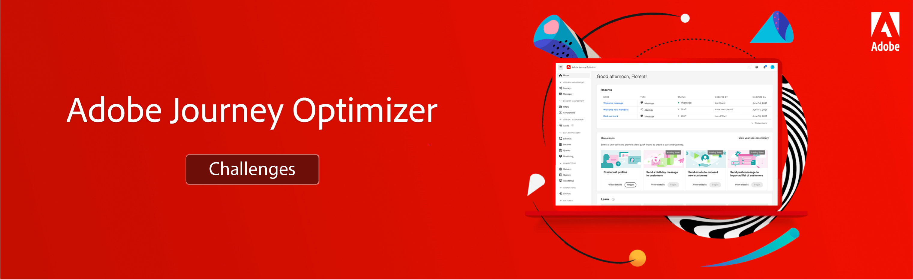

# Journey Optimizer Challenges - Introduction

Challenges provide a scenario and the requirements needed to practice what you learned. Challenges help you evaluate your skill level and identify knowledge gaps. Each challenge in this section addresses a unique use case.

The target audience (persona), as well as the required skills are listed at the beginning of each challenge

To develop the knowledge and skills needed for the following challenges, complete the [Getting started with Journey Optimizer for Journey Managers and Administrators](https://experienceleague.adobe.com/?recommended=JourneyOptimizer-U-1-2021.1) course.

## The Story

Luma, a fictional athletic apparel company, is looking to promote its latest apparel and gear collection and to drive sales for existing customers. Luma uses Adobe Journey Optimizer to deliver connected, contextual, and personalized experiences to their customers.

You have been hired to implement the Luma marketing and retention campaigns in Journey optimizer.

## Your Challenges

<table>
<tr>
<td>
 

      
      

  </td>
  <td>
   <a href="./create-summer-collection-announcement-challenge.md">
    <strong>Challenge 1: 
 Create a summer collection announcement </strong>
    </a>
      

      <em>Send a summer collection announcement to a segment of existing customers' to promote the new Luma summer collection.</em>
      

    </td>
  </tr>
  <tr>
  <td>
  

    
  </td>
  <td>
      <a href="./create-segments-challenge.md">
    <strong>Challenge 2:
Create an order confirmation</strong>
    </a>
    

    

    <em>Create and personalize a transactional order confirmation message.
    </em>
    

  </td>
  </tr>
  <tr>
    <td>
    

    
    

    <td>
    

      <a href="./create-journeys-challenge.md">
    <strong>Challenge 3:
Create Journeys </strong>
    </a>
    

    

    <em>Implement Luma's customer journeys for the following use cases:
      <li>
      Promote the new Luma summer collection
      </li> 
      <li>
      Send an order confirmation email when someone completes an online purchase
      </li> 
      <li> 
      Send an email when a loyalty customer moves to a new tier to congratulate and inform them of their new benefits
      </li> 
      <li>
      Notify customers, when a previously out-of-stock item is back in stock
      </li>
      </em>
    

  </td>
</table>

## Do you have everything you need?

### System requirements

* Access to a Journey Optimizer instance
* AEM Assets Essentials must be provisioned for your instance
* It is recommended to complete the challenge in a dedicated training sandbox. Refer to the [Set-up a training sandbox tutorial](/help/tutorial-set-up-training-sandbox/overview.md) for instructions.
  * Make sure you have either *Journey Manager* or *Journey Administrator* rights

### Required actions

Before you can get started you should [download all Luma assets](/help/challenges/assets/email-assets/luma-assets.zip).
