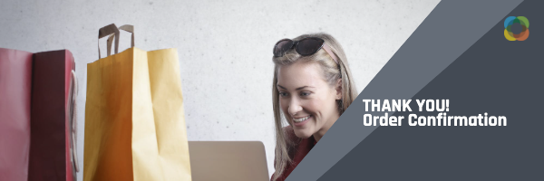

# Journey Optimizer Challenges - Introduction and prerequisites

Challenges provide a scenario and the requirements needed to practice what you learned. Challenges help you evaluate your skill level and identify knowledge gaps. 

Each challenge in this section addresses a unique use case that you will implement. The target audience (persona), and the required skills are listed at the beginning of each challenge.

## Prerequisites

### System requirements

* Access to a Journey Optimizer sandbox - we recommended to complete the challenge in a dedicated training sandbox. 
* AEM Assets Essentials must be provisioned for your instance
* The email channel must be configured for transactional and marketing messages

### Access rights

You need the following access rights:
* *Journey Manager* or *Journey Administrator*
* View test profiles and their attributes

>[!NOTE]
> The exercises were developed based on the Luma sample data. It is recommended to set up a training sandbox configured with the sample data. Please visit the tutorial [Configure a training sandbox](/help/tutorial-configure-a-training-sandbox/introduction-and-prerequisites.md) for instructions for detailed instructions.

### Required actions

*   If you are new to Adobe Journey Optimizer, complete the course [Getting started with Journey Optimizer for Journey Managers and Administrators](https://experienceleague.adobe.com/?recommended=JourneyOptimizer-U-1-2021.1).

## The Story

Luma is a fictional athletic apparel company, with stores in multiple countries, an online presence with a website, and mobile apps. Luma uses Adobe Journey Optimizer to deliver connected, contextual, and personalized experiences to their customers.

Luma is looking to promote its latest apparel and gear collection and to drive sales for existing customers. You have been hired to implement the Luma marketing and retention campaigns in Journey Optimizer.

## Your Challenges

<table>
<tr>
<td>
 

      
      

  </td>
  <td>
   <a href="summer-collection-announcement-challenge.md">
    <strong>Create a summer collection announcement </strong>
    </a>
      

      <em>Promote the new Luma summer collection. </em>
      

      <b>Required skills:</b>
      <li><a href=https://experienceleague.adobe.com/docs/journey-optimizer-learn/tutorials/profiles-segments-subscriptions/create-segments.html> Create segments</li>
      <li><a href=https://experienceleague.adobe.com/docs/journey-optimizer-learn/tutorials/create-messages/create-emails/import-and-author-html-email-content.html>Import and author HTML email content</li>
      <li><a href=https://experienceleague.adobe.com/docs/journey-optimizer-learn/tutorials/create-journeys/use-case-read-segment.html>Use Case - Read segment</li>
  </td>
  </tr>
  <tr>
  <td>
  

    
  </td>
  <td>
      <a href="order-confirmation-challenge.md">
    <strong>Create an order confirmation</strong>
    </a>
    

    

    <em>Send an order confirmation email when someone completes an online purchase
    </em>
    

  </td>
  </tr>
  <tr>
    <td>
    

    
    

    <td>
    

      <a href="product-replenishment-challenge.md">
    <strong>Create a product replenishment notification </strong>
    </a>
    

    

    <em>Notify customers, when a previously out-of-stock item is back in stock</em>
    

  </td>
  </tr>
  <tr>
    <td>
    

    
    

    <td>
    

      <a href="loyalty-status-welcome-email-challenge.md">
    <strong>Create a loyalty status welcome email </strong>
    </a>
    

    

    <em>Send an email when a loyalty customer moves to a new tier to congratulate and inform them of their new benefits</em>
    

  </td>
  </tr>
</table>
