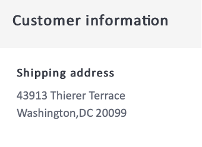

# Create an order confirmation email


|Challenge|Create an order confirmation transactional email|
|---|---|
|Persona|Journey Manager|
|Required skills|<ul><li>[Create email content with the message editor](https://experienceleague.adobe.com/docs/journey-optimizer-learn/tutorials/create-messages/create-email-content-with-the-message-editor.html?lang=en)</li> <li>[Use contextual event information for personalization](https://experienceleague.adobe.com/docs/journey-optimizer-learn/tutorials/personalize-content/use-contextual-event-information-for-personalization.html?lang=en)</li><li>[Use helper functions for personalization](https://experienceleague.adobe.com/docs/journey-optimizer-learn/tutorials/personalize-content/use-helper-functions-for-personalization.html?lang=en)</li></ul>|
|Assets to download|[Order confirmation assets](/help/challenges/assets/email-assets/order-confirmation-assets.zip)|

## The Story

Luma, is launching their online store and want to ensure a good customer experience by providing an order confirmation email once a customer has placed an order.


## Your Challenge

Create a journey that sends an order confirmation email when a Luma customer completes an online order.

>[!BEGINTABS]

>[!TAB Task]

1. Create a journey called "your name _Order Confirmation" 
2. Use the event: [!DNL LumaOnlinePurchase] as a trigger
   
3. Create the order confirmation email:
  
* Category transactional - make sure to select the transactional email surface
* The subject line must be personalized with the recipients' first name and must include the phrase "thank you for your purchase"

Following the Luma brand guideline the email should be structured as follows - you can use the **Luma - Order summary** template and modify it:

<table>
<tr>
<td>
  <div>
     <strong> Header Section</strong>
      </div>
  </td>
  <td>
    <strong>Luma logo</strong>
      <p>
     <li>luma_logo.png</li>
    <li>Size 35%, centered white background </li>
    <li>It should have a link to the luma website: https://publish1034.adobedemo.com/content/luma/us/en.html</li>
    <p>
    </td>
  </tr>
  <tr>
  <td>
  <div>
    <strong>Order Confirmation Section
    </strong>
  </td>
  <td>
    <strong>Image</strong><p>
    <li>luma-transactional-order-confirmation-2.jpg </li>
    <li>Margin: Top, bottom (10)<div>
    <p>
    <strong>Text</strong><p>
    <em>Hey {first name}</em><p>
    <li>Alignment: left  </li>
   <li>Text color: rgb(101, 106, 119); font-size:14px</li>
    <li>Padding: left (95), right (95)</li><div>
    <p>
     <em>Your order has been placed.
    <p>Once your package ships, we will send you an email with a tracking number so you can track your order.</p></em>
    </strong><p>
    <li>Alignment: left  </li>
    <li>Text color: rgb(101, 106, 119); font-size:14px </li>
    <li>Padding: left (95), right (95)</li><div>
    </a><p>
    <em>Ship to:<p>
    <p>First Name Last Name</p>
    Street<p>
    City, State, Postalcode</p></em>
    <strong>Button:</strong></p>
   <p><em>View order</em></p>
      <li>Background color: rgb(25, 121, 195)</li>
      <li>Text color: White</li>
      <li>No border</li>
      <li>Height: 40</li>
      <li>Add a link to a website of your choice </li>
      <li>Left align with the text above (tip: use the container margin)</li>
  </td>
 <tr>
<td>
  <div>
     <strong>Order Details Section</strong>
      </div>
      <p>Tips:
      <li>This is contextual event information.</li>
      <li>Use the helper function: Each</li>
      <li>Switch to the code editor format to add the contextual data. <li>
      <li>Put the information into containers using DIV tags.</li>
  </td>
  <td>
    <strong>Header</strong>
    <p>
    <em>Order {Purchase Order Number}</em>
    </p>
    <strong>List of products that were ordered:
  </strong>
  <p>Each of the items should be formatted like this:
    
</p>
<strong>Product Image:</strong>
<li>class: cart-item-chair
<li>style: border-box: min-height:40px</li>
<li>padding top and bottom:20px</li>
<li>padding-left:80px</li>
<li>border-radius:0px</li>
<li>Use as background image for the container</li>
<li>background-position: 0% 50%</li>
<li>background-size: 60px</li>
<li>background-repeat: no-repeat</li>
<p>
<strong>Price:</strong>
<li>Format = H5</li>
<li>style = box-sizing:border-box</li>
<li>margin-bottom:5px</li>
<li>margin-top:0px;</li>
<p>
<strong>Name and Quantity:</strong>
<li>class=text-small</li>
<li>style=box-sizing: border-box</li>
<li>padding-top: 5px</li>
<li>color: rgb(101, 106, 119)</li>
<li>font-size:14px</li>
<p>
</td>
  </tr>
</table>


>[!TIP]
>
>To allow you to troubleshoot your journeys, best practice is to add an alternative path to all message actions in case of timeout or error.


>[!TAB Check your work]

Trigger the Journey you created in test mode and send the email to yourself:

1.  Show the hidden values by clicking the eye symbol:
    1.  In the Email parameters click on the T symbol (enable parameter override
      
    2.  Click into the Address field
    3.  On the next screen add your email address in parentheses: *yourname@yourdomain* in the expression editor and click ok.  
2.  Put the journey into test mode
3.  Trigger the event with the following parameters:
    * Set the profile identifier to: Jenna_Palmer9530@emailsim.io
    * Event Type: commerce.purchases
    * Name: Sprite Yoga Companion Kit
    * Quantity: 1
    * Price Total: 61
    * Order number: 6253728
    * SKU: 24-WG080
    * productImageURL: <https://publish1034.adobedemo.com/content/dam/luma/en/products/gear/fitness-equipment/luma-yoga-kit-2.jpg>

You should receive the personalized purchase confirmation email, with the specified product.

*   The subject line should start with your test profile's first name: Jenna
*   The order detail section should be populated with the order details you entered while testing
*   The customer information should have your test profile's city and postal code:

    43913 Thierer Terrace,
    Washington DC 20099


>[!TAB Success Criteria]

** Journey


** Email

**Subject line:**

{{ profile.person.name.firstName }}, thank you for your purchase!


**Oder detail section:**


This is what your code should look like:

Header:

```javascript
Order: {{context.journey.events.1627840522.commerce.order.purchaseOrderNumber}}
```

List of products:

Use the helper function "each" to create the list of products. This is what your code should look like:

```javascript
{{#each context.journey.events.1911672547.productListItems as|product|}}
<div class="cart-item-chair" style="box-sizing:border-box;min-height:40px;padding-top:20px;padding-bottom:20px;padding-left:80px;border-radius:0px;background-image:url({{product._wwfovlab065.productImageURL}});background-position:0% 50%;background-size:60px;background-repeat:no-repeat;">
<h5 style="box-sizing:border-box;margin-bottom:5px;font-size:16px;line-height:20px;margin-top:0px;">${{product.priceTotal}}.00</h5>
<div class="text-small" style="box-sizing:border-box;padding-top:5px;color:rgb(101, 106, 119);font-size:14px;">{{product.name}}</div><div class="text-small" style="box-sizing:border-box;padding-top:5px;color:rgb(101, 106, 119);font-size:14px;">Quantity: {{product.quantity}}</div></div><div class="divider-small" style="box-sizing:border-box;height:1px;margin-top:10px;margin-bottom:10px;background-color:rgb(209, 213, 223);"> </div>
{{/each}}

Total: ${{context.journey.events.1627840522.commerce.order.priceTotal}} 
```

**Customer information Section**



The personalization should look like this:

```javascript
{{profile.homeAddress.street1}}
{{profile.homeAddress.city}},{{profile.homeAddress.state}} {{profile.homeAddress.postalCode}}
```

>[!ENDTABS]