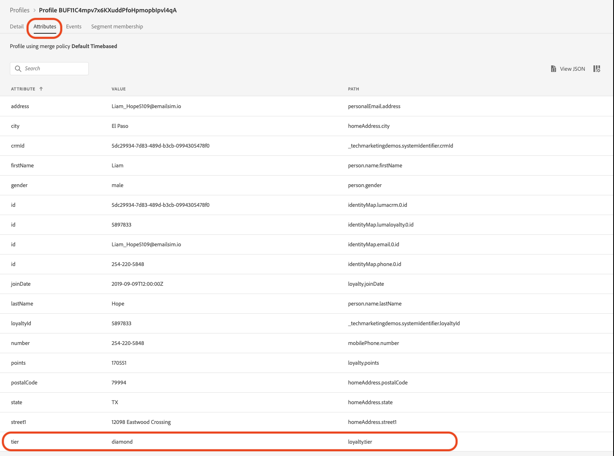
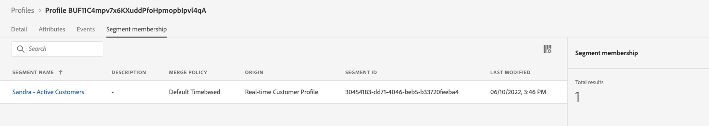

# Create a Summer Collection announcement - challenge

|Challenge|Create a Summer Collection announcement|
|---|---|
|Persona|Journey Manager|
|Required skills|<ul><li>[Create segments](https://experienceleague.adobe.com/docs/journey-optimizer-learn/tutorials/profiles-segments-subscriptions/create-segments.html?lang=en)</li><li> [Import and author HTML email content](https://experienceleague.adobe.com/docs/journey-optimizer-learn/tutorials/create-messages/create-emails/import-and-author-html-email-content.html?lang=en)</li><li>[Use Case - Read segment](https://experienceleague.adobe.com/docs/journey-optimizer-learn/tutorials/journeys/use-case-read-segment.html?lang=en)</li>|
|Assets to download|[Seasonal Collection email files](/help/challenges/assets/email-assets/emails-seasonal-collection-announcement.zip)|

{style="table-layout:auto"}

## The story

Luma, a fictional athletic apparel company, is promoting its latest apparel and gear collection and to drive sales for existing customers. Luma is launching the new Summer Collection and would like to specifically target different audiences.  

## Your challenge

The Luma marketing team asks you to implement a Summer Collection marketing campaign in Journey Optimizer. Your challenge is to:

* Create an audience defining which profiles qualify to receive the promotion.
* Build the journey.

### Step 1: Define the audience - Active Customers

>[!BEGINTABS]

>[!TAB Task]

#### Create an audience in [!DNL Journey Optimizer]

* Create an audience in [!DNL Journey Optimizer] called *Active Customers*.
* The segment must include only active Luma customers.
* Active customers are defined as customers who have a tier in Luma's loyalty program (bronze, silver, gold, or platinum).


>[!TAB Success Criteria]

In the segment builder, you can see the estimated number of qualified profiles. If you are working with the training sandbox data, you have around 753 qualified profiles out of 1.29 K.

>[!NOTE]
>It can take up to 24 hours for the segment membership to appear for existing profiles, as the existing profiles need to be backfilled.

**A qualifying profile has been added to the segment:**

You can check the profiles that have been added to the segment qualify by navigating to one of in the profiles listed on your segment's detail view. 

On the profile page, check the [!UICONTROL Attributes] tab to confirm that they qualify: The tier should be silver, gold, platinum, or diamond.



You can also check the [!UICONTROL Segment membership] tab: Your segment should be listed.

   

>[!TAB Check your work]

Segment fields: **[!UICONTROL Attributes]** > **[!UICONTROL XDM individual Profile]** > **[!UICONTROL Loyalty]** > **[!UICONTROL Tier]**

This is what your segment should look like:


The code should look like this:

```javascript

stringCompare("equals", loyalty.tier, ["diamond", "gold", "platinum", "silver"], false)

```

>[!ENDTABS]


### Step 2: Create the Journey - Summer Collection announcement

>[!BEGINTABS]

>[!TAB Task]

#### Send the Summer Collection announcement 

An agency provided you with four HTML files with the design for the emails: 

* `SeasonalCollectionEmail.html`
* Luma Men's Collection email
* Luma Women's Collection email
* Luma - 20 % off Collection email

1. [Download the Seasonal Collection email files](/help/challenges/assets/email-assets/emails-seasonal-collection-announcement.zip). 

1. Create a journey called *Luma - Summer Collection announcement* based on the following guidelines:

   1. Send *Luma - New Summer Collection Announcement* email to the *Active Customers* segment, holding out 10% of the audience as a control group 
       * Message title *Luma - Summer Collection Announcement*
       * Subject line *(recipient's first name), the new Luma summer collection is here!*
       * Use the provided HTML file `SeasonalCollectionEmail.html` for the email body.
   1. Wait two days then send a follow-up email message with more targeted content:
      * Male customers should receive the **Luma Men's Collection** email.
         * Message title: *Luma Men's Collection*
         * Subject line: *(recipient's first name), explore Men's New athletic gear!*
         * Email body: `MensCollectionEmail.html` for the email body.
      * Female customers should receive the **Luma Women's Collection** email.
         * Message title: *Luma Women's Collection*
         * Subject line: *(recipient's first name), explore Luma's Women Collection!*
         * Email body: `WomensCollectionEmail.html`
      *   Other customers should receive the **Luma - 20 % off Collection** email.
         * Message title: *Luma - 20 % off Collection*
         * Subject line: *(recipient's first name), enjoy 20% off sales!*
         * Email body: `20OOffCollectionEmail.html`
   1. After sending the targeted emails above, wait two days for the email to be opened
   1. If the targeted email is not opened within 2 days, send the **Luma - 20 %off Collection email** as a final retargeting attempt


>[!TAB Success criteria]

#### Preview the emails

**Email Message #1 - Luma -  Summer collection announcement**

Preview the email:

1. Add a test profile: Louise Petti:
   * Identity namespace: *Luma CRM ID* 
   * Identity value: *d1f132f9f9502bba047a6ec86c4b61f9*

Result:

* The subject line should read: Louise, the new Luma collection is here!

**Email Message #2 - Luma Men's Collection**

Send a proof to yourself:

1. Add a test profile: Stanleigh Stooke:
   * Identity namespace: *Luma CRM ID* 
   * Identity value: `4f34057d9d9e792c28ba18ecae378e98`
2. Select the test profile: Stanleigh Stooke.
3. Send a proof to yourself.

Result:  
You should receive an email. The subject line should read *Stanleigh, explore Men's New athletic gear!* and the email body should match what you have seen in the preview.

>[!NOTE]
>It can take a couple of minutes for you to receive the proof.

**Email message #3 - Luma Women's Collection**

Preview the email with the test profile *Louise Petti.*

* The subject line should read: *Louise, explore Luma's Women Collection!*

**Email message #4 - Luma 20 % off Collection**

Preview the email with the test profile *Louise Petti.*

* The subject line should read: *Louise, enjoy 20% off sales!*

#### Test your journey

>[!IMPORTANT]
>
>Before you set the journey into test mode:
>
>1. Make sure that the [!UICONTROL Read Segment Activity] has the namespace set to **Luma CRM id(lumaCrmId)**
>1. For each email, override the default email parameters for the emails so that they are sent to your email address:
>    * Show the hidden values by clicking the eye symbol.
>    * In the email parameters, click the T symbol (enable parameter override).
>
>      
> 
>    *   Click into the [!UICONTROL Address] field
>    *   On the next screen, add your email address in parentheses: `"yourname@yourdomain"` in the expression editor and click ok.
>

Test the journey and have the emails sent to your own account:

1.  Put the journey into test mode.
1.  Select **[!UICONTROL Single profile at a time]**.
1.  Wait time: Set the timer to 120 seconds (type it into the field).
1.  Trigger profile entrance
1.  You can test each branch by using one of the following *Luma CRM Ids* as profile identifiers:
    * Female: Leora Dietsche, Identity value:`a8f14eab3b483c2b96171b575ecd90b1`
    * Male: Stanleigh Stooke,  Identity value: `4f34057d9d9e792c28ba18ecae378e98`
    * Gender not specified: Louise Petti, Identity value: `d1f132f9f9502bba047a6ec86c4b61f9`

1.  After you trigger the profile entrance, you should receive the first email. The header should be personalized according to the profile you chose.
1.  The journey should continue into the respective branch, and you should receive the related email (for example, if you chose *Jenna*, you should receive the *Luma Women's Collection* email).
1.  Open the second email and the journey should end.
1.  You can repeat step 4. - 7. for all three profiles to check if your branches are working correctly.
1.  To test the time outs, set the wait time to 30 seconds and trigger the entry again.
1.  Do not open the emails you receive (do not preview the email (!)) and let the wait time laps.

You should receive the following emails:

* Luma - New Seasonal Collection Announcement
* Depending on which test profile you used, you should receive one of the following emails:
  * Leora: Luma Women's Collection
  * Stanleigh: Luma Men's Collection
  * Louise: Luma - 20% Off Collection
* If you did not open the second email: The Luma - 20% Off Collection

>[!TAB Check your work]

This is what your journey should look like:


**Condition - Control Group:**


**Condition - Gender:**\


>[!ENDTABS]
