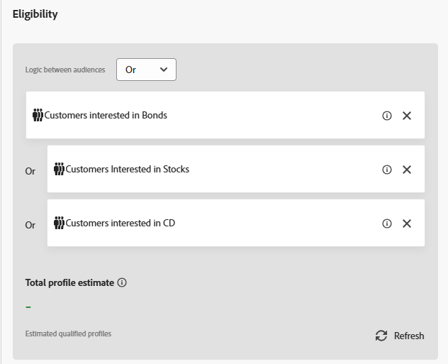

# Create a selection strategy

A selection strategy is a reusable configuration that combines a collection of offers with eligibility rules and a ranking method to determine which offers are shown when the strategy is used in a decision policy.

To restrict the selection of the offers to the members of an Experience Platform audience, select Audiences and choose an audience from the list. For this tutorial, the audiences created in the earlier tutorial are used.

