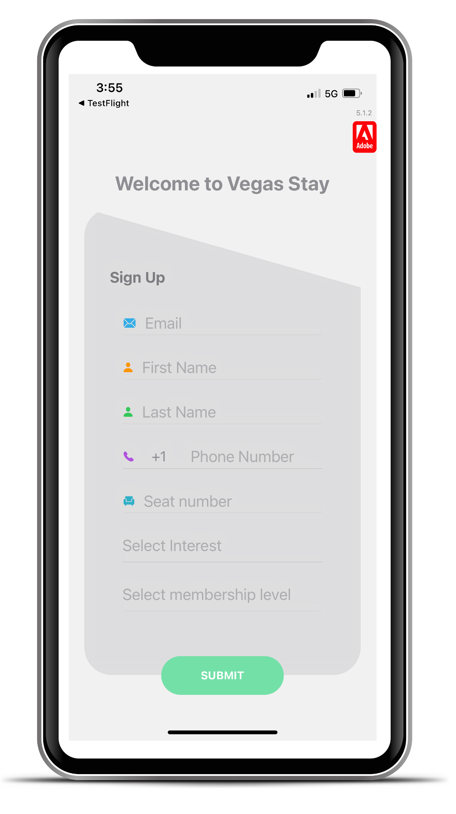

# Exercise 1.2: Register as a User with the App

>[!IMPORTANT]
>Please sign up with an **email address that you can access during the lab session**, and **your mobile phone number**. 
>
> This information is required for you to receive the messages you will be sending. It also allows you to access your information in Journey Optimizer. It will not be used for any purpose other than for this lab.

1.  Open the app.
1.  In the pop up, click Allow.
1.  Sign up: 

    When opening the app for the first time, you will be asked to sign up. Please enter the following detailS:

    <table>
    <tr>
    <td>
    

     
    

    </td>
    <td>
    <strong>Email: </strong> Enter an email address that you can access during the lab.
    

    <strong>First Name, Last Name </strong>
    

    <strong>Phone Number: </strong>  Enter your mobile phone number using the following format: 
    
+16501245566 (+country code phone number).
    

    <strong>Seat number: </strong> Your seat number is located at your workstation. It is VERY IMPORTANT to enter the correct seat number!
    

    <strong>Select Interest: </strong> Sports, Wellness, Dining, or Entertainment
    

    <strong>Select membership level: </strong> Red, Blue, Green, or Yellow

    </td>
    </tr>
    </table>

1. Click **Submit**

>[!SUCCESS]
>
>You have created an app user and a profile for this user has been created in Adobe Journey Optimizer.
>
