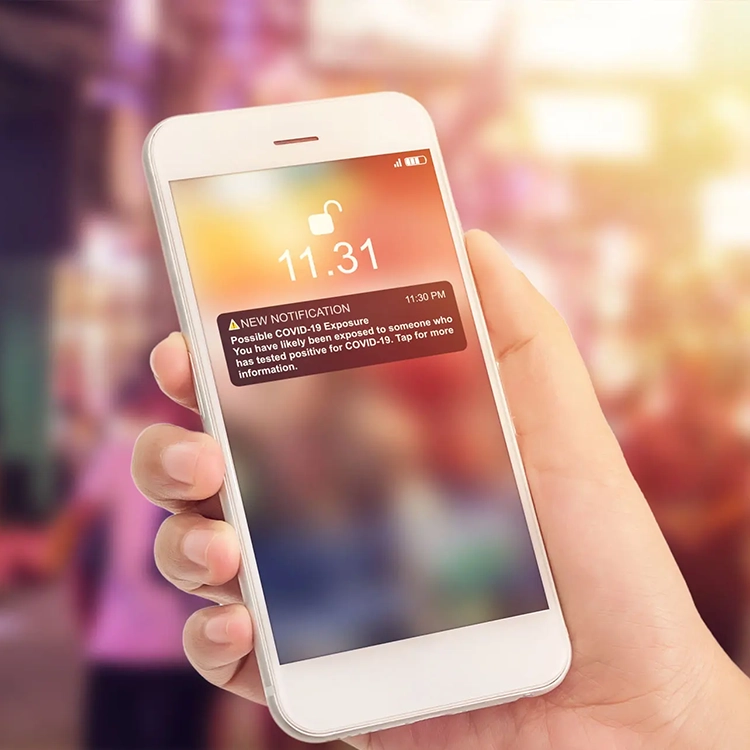

# Design and deliver

Learn how to confidently plan, build, and manage effective mobile campaigns within Adobe Journey Optimizer. Understand the unique features and limitations of mobile channels like push and in-app messaging, and content cards, how to respect user consent while maximizing engagement, and how to measure and optimize campaigns for the best possible results — all with practical, actionable guidance to get started quickly and grow mobile success over time.

## 1. Understand and configure mobile messages

Learn how to configure mobile messages per channel:

>[!BEGINTABS]

>[!TAB Overview]

Understand which mobile channels Journey Optimizer supports and how to configure and send messages using these channels.

>[!VIDEO](https://video.tv.adobe.com/v/3426021?quality=12&learn=on){transcript=true}

>[!TAB Push]

Understand how to build push notifications, to engage mobile app users at any time with personalized targeted messages.

<!-- CARDS
* https://experienceleague.adobe.com/en/docs/journey-optimizer-learn/tutorials/channels/push-channel/push-notifications-overview
* https://experienceleague.adobe.com/en/docs/journey-optimizer-learn/tutorials/channels/push-channel/create-a-push-campaign
-->
<!-- START CARDS HTML - DO NOT MODIFY BY HAND -->

    

        

            

                <figure class="image x-is-16by9">
                    
                </figure>
            

            

                

                    

                        <a href="https://experienceleague.adobe.com/en/docs/journey-optimizer-learn/tutorials/channels/push-channel/push-notifications-overview" target="_blank" rel="referrer" title="Push notifications- Overview">Push notifications- Overview</a>
                    

                    
Understand how to build push notifications, to engage mobile app users at any time with personalized targeted messages.

                

                <a href="https://experienceleague.adobe.com/en/docs/journey-optimizer-learn/tutorials/channels/push-channel/push-notifications-overview" target="_blank" rel="referrer" class="spectrum-Button spectrum-Button--outline spectrum-Button--primary spectrum-Button--sizeM" style="align-self: flex-start; margin-top: 1rem;">
                    Watch
                </a>
            

        

    

    

        

            

                <figure class="image x-is-16by9">
                    
                </figure>
            

            

                

                    

                        <a href="https://experienceleague.adobe.com/en/docs/journey-optimizer-learn/tutorials/channels/push-channel/create-a-push-campaign" target="_blank" rel="referrer" title="Configure and send a push campaign">Configure and send a push campaign</a>
                    

                    
Learn how to configure and send a push notification with a campaign.

                

                <a href="https://experienceleague.adobe.com/en/docs/journey-optimizer-learn/tutorials/channels/push-channel/create-a-push-campaign" target="_blank" rel="referrer" class="spectrum-Button spectrum-Button--outline spectrum-Button--primary spectrum-Button--sizeM" style="align-self: flex-start; margin-top: 1rem;">
                    Watch
                </a>
            

        

    

<!-- END CARDS HTML - DO NOT MODIFY BY HAND -->

### Documentation

<table style="table-layout:fixed"><tr style="border: 0;">
<td>

<a href="https://experienceleague.adobe.com/en/docs/journey-optimizer/using/channels/push/create-push"><strong>Create a push notification</strong>

</td>
<td>

<a href="https://experienceleague.adobe.com/en/docs/journey-optimizer/using/channels/push/design-push"><strong>Design your push notification</strong></a>

</td>
<td>

    

    <a href="https://experienceleague.adobe.com/en/docs/journey-optimizer/using/channels/push/send-push"><strong>Send your push notification</strong></a>
    

    

    </td>
</tr>
</table>

>[!TAB In-app]

Understand how to create and send in-app messages that are relevant to individual customers.

<!-- CARDS
* https://experienceleague.adobe.com/docs/journey-optimizer-learn/tutorials/in-app-channel/author-in-app-messages.html
* https://experienceleague.adobe.com/en/docs/journey-optimizer-learn/tutorials/create-campaigns/action-campaigns/in-app
* https://experienceleague.adobe.com/docs/journey-optimizer-learn/tutorials/in-app-channel/create-an-in-app-message-in-a-journey.html
* https://experienceleague.adobe.com/docs/journey-optimizer-learn/tutorials/in-app-channel/create-experiments-for-in-app-messages.html
-->
<!-- START CARDS HTML - DO NOT MODIFY BY HAND -->

    

        

            

                <figure class="image x-is-16by9">
                    
                </figure>
            

            

                

                    

                        <a href="https://experienceleague.adobe.com/docs/journey-optimizer-learn/tutorials/in-app-channel/author-in-app-messages.html" target="_blank" rel="referrer" title="Author an in-app message">Author an in-app message</a>
                    

                    
Learn how to author and test an in-app message.

                

                <a href="https://experienceleague.adobe.com/docs/journey-optimizer-learn/tutorials/in-app-channel/author-in-app-messages.html" target="_blank" rel="referrer" class="spectrum-Button spectrum-Button--outline spectrum-Button--primary spectrum-Button--sizeM" style="align-self: flex-start; margin-top: 1rem;">
                    Learn more
                </a>
            

        

    

    

        

            

                <figure class="image x-is-16by9">
                    
                </figure>
            

            

                

                    

                        <a href="https://experienceleague.adobe.com/en/docs/journey-optimizer-learn/tutorials/create-campaigns/action-campaigns/in-app" target="_blank" rel="referrer" title="Create an in-app campaign">Create an in-app campaign</a>
                    

                    
Understand what an in-app message is. Learn how to create, configure, and publish in-app messages in Campaigns.

                

                <a href="https://experienceleague.adobe.com/en/docs/journey-optimizer-learn/tutorials/create-campaigns/action-campaigns/in-app" target="_blank" rel="referrer" class="spectrum-Button spectrum-Button--outline spectrum-Button--primary spectrum-Button--sizeM" style="align-self: flex-start; margin-top: 1rem;">
                    Learn more
                </a>
            

        

    

    

        

            

                <figure class="image x-is-16by9">
                    
                </figure>
            

            

                

                    

                        <a href="https://experienceleague.adobe.com/docs/journey-optimizer-learn/tutorials/in-app-channel/create-an-in-app-message-in-a-journey.html" target="_blank" rel="referrer" title="Create an in-app message in a journey">Create an in-app message in a journey</a>
                    

                    
Understand what an in-app message is and how it can be applied in a journey. Learn how to create an in-app message in a journey and how to test and publish your journey.

                

                <a href="https://experienceleague.adobe.com/docs/journey-optimizer-learn/tutorials/in-app-channel/create-an-in-app-message-in-a-journey.html" target="_blank" rel="referrer" class="spectrum-Button spectrum-Button--outline spectrum-Button--primary spectrum-Button--sizeM" style="align-self: flex-start; margin-top: 1rem;">
                    Watch
                </a>
            

        

    

    

        

            

                <figure class="image x-is-16by9">
                    
                </figure>
            

            

                

                    

                        <a href="https://experienceleague.adobe.com/docs/journey-optimizer-learn/tutorials/in-app-channel/create-experiments-for-in-app-messages.html" target="_blank" rel="referrer" title="Configure content experiments for in-app messages">Configure content experiments for in-app messages</a>
                    

                    
Learn how to configure and analyze content experiments to A/B test in-app messages.

                

                <a href="https://experienceleague.adobe.com/docs/journey-optimizer-learn/tutorials/in-app-channel/create-experiments-for-in-app-messages.html" target="_blank" rel="referrer" class="spectrum-Button spectrum-Button--outline spectrum-Button--primary spectrum-Button--sizeM" style="align-self: flex-start; margin-top: 1rem;">
                    Watch
                </a>
            

        

    

<!-- END CARDS HTML - DO NOT MODIFY BY HAND -->

>[!TAB SMS/MMS/RCS]

<!-- CARDS
* https://experienceleague.adobe.com/en/docs/journey-optimizer-learn/tutorials/channels/sms-channel/sms-mms-messages-overview
* https://experienceleague.adobe.com/en/docs/journey-optimizer-learn/tutorials/channels/sms-channel/author-sms-messages
* https://experienceleague.adobe.com/en/docs/journey-optimizer-learn/tutorials/channels/sms-channel/author-mms
* https://experienceleague.adobe.com/en/docs/journey-optimizer-learn/tutorials/channels/sms-channel/sms-double-opt-in
-->
<!-- START CARDS HTML - DO NOT MODIFY BY HAND -->

    

        

            

                <figure class="image x-is-16by9">
                    
                </figure>
            

            

                

                    

                        <a href="https://experienceleague.adobe.com/en/docs/journey-optimizer-learn/tutorials/channels/sms-channel/sms-mms-messages-overview" target="_blank" rel="referrer" title="SMS/MMS messages - Overview">SMS/MMS messages - Overview</a>
                    

                    
Understand how to to create, schedule, and distribute SMS and MMS messages to reach your customers easily on the go.

                

                <a href="https://experienceleague.adobe.com/en/docs/journey-optimizer-learn/tutorials/channels/sms-channel/sms-mms-messages-overview" target="_blank" rel="referrer" class="spectrum-Button spectrum-Button--outline spectrum-Button--primary spectrum-Button--sizeM" style="align-self: flex-start; margin-top: 1rem;">
                    Watch
                </a>
            

        

    

    

        

            

                <figure class="image x-is-16by9">
                    
                </figure>
            

            

                

                    

                        <a href="https://experienceleague.adobe.com/en/docs/journey-optimizer-learn/tutorials/channels/sms-channel/author-sms-messages" target="_blank" rel="referrer" title="Configure, author, and deliver SMS messages">Configure, author, and deliver SMS messages</a>
                    

                    
Learn how to configure, author, and deliver SMS messages in Journey Optimizer campaigns and journeys.

                

                <a href="https://experienceleague.adobe.com/en/docs/journey-optimizer-learn/tutorials/channels/sms-channel/author-sms-messages" target="_blank" rel="referrer" class="spectrum-Button spectrum-Button--outline spectrum-Button--primary spectrum-Button--sizeM" style="align-self: flex-start; margin-top: 1rem;">
                    Learn more
                </a>
            

        

    

    

        

            

                <figure class="image x-is-16by9">
                    
                </figure>
            

            

                

                    

                        <a href="https://experienceleague.adobe.com/en/docs/journey-optimizer-learn/tutorials/channels/sms-channel/author-mms" target="_blank" rel="referrer" title="Author an MMS message">Author an MMS message</a>
                    

                    
Learn how to connect Journey Optimizer to an MMS service provider and how to create an MMS channel surface.

                

                <a href="https://experienceleague.adobe.com/en/docs/journey-optimizer-learn/tutorials/channels/sms-channel/author-mms" target="_blank" rel="referrer" class="spectrum-Button spectrum-Button--outline spectrum-Button--primary spectrum-Button--sizeM" style="align-self: flex-start; margin-top: 1rem;">
                    Watch
                </a>
            

        

    

    

        

            

                <figure class="image x-is-16by9">
                    
                </figure>
            

            

                

                    

                        <a href="https://experienceleague.adobe.com/en/docs/journey-optimizer-learn/tutorials/channels/sms-channel/sms-double-opt-in" target="_blank" rel="referrer" title="Double opt-in for Sinch and Infobip">Double opt-in for Sinch and Infobip</a>
                    

                    
Learn how to configure double opt-in for SMS.

                

                <a href="https://experienceleague.adobe.com/en/docs/journey-optimizer-learn/tutorials/channels/sms-channel/sms-double-opt-in" target="_blank" rel="referrer" class="spectrum-Button spectrum-Button--outline spectrum-Button--primary spectrum-Button--sizeM" style="align-self: flex-start; margin-top: 1rem;">
                    Watch
                </a>
            

        

    

<!-- END CARDS HTML - DO NOT MODIFY BY HAND -->

>[!TAB Content Cards]

<!-- CARDS
* https://experienceleague.adobe.com/en/docs/journey-optimizer-learn/tutorials/channels/content-cards/create-content-cards
-->
<!-- START CARDS HTML - DO NOT MODIFY BY HAND -->

    

        

            

                <figure class="image x-is-16by9">
                    
                </figure>
            

            

                

                    

                        <a href="https://experienceleague.adobe.com/en/docs/journey-optimizer-learn/tutorials/channels/content-cards/create-content-cards" target="_blank" rel="referrer" title="Create content cards">Create content cards</a>
                    

                    
Learn how to create content cards for your application.

                

                <a href="https://experienceleague.adobe.com/en/docs/journey-optimizer-learn/tutorials/channels/content-cards/create-content-cards" target="_blank" rel="referrer" class="spectrum-Button spectrum-Button--outline spectrum-Button--primary spectrum-Button--sizeM" style="align-self: flex-start; margin-top: 1rem;">
                    Watch
                </a>
            

        

    

<!-- END CARDS HTML - DO NOT MODIFY BY HAND -->

>[!TAB Code-based experiences]

<!-- CARDS
* https://experienceleague.adobe.com/en/docs/journey-optimizer-learn/tutorials/channels/code-based-experience-channel/create-a-code-based-experience-campaign
* https://experienceleague.adobe.com/en/docs/journey-optimizer-learn/tutorials/channels/code-based-experience-channel/form-fields-in-code-based-experiences
-->
<!-- START CARDS HTML - DO NOT MODIFY BY HAND -->

    

        

            

                <figure class="image x-is-16by9">
                    
                </figure>
            

            

                

                    

                        <a href="https://experienceleague.adobe.com/en/docs/journey-optimizer-learn/tutorials/channels/code-based-experience-channel/create-a-code-based-experience-campaign" target="_blank" rel="referrer" title="Create a code-based experience campaign.">Create a code-based experience campaign.</a>
                    

                    
Learn how to create a code based experience campaign to scale personalization with support for server-side, API-based, or SDK-based implementation methods to seamlessly integrate with development environments.

                

                <a href="https://experienceleague.adobe.com/en/docs/journey-optimizer-learn/tutorials/channels/code-based-experience-channel/create-a-code-based-experience-campaign" target="_blank" rel="referrer" class="spectrum-Button spectrum-Button--outline spectrum-Button--primary spectrum-Button--sizeM" style="align-self: flex-start; margin-top: 1rem;">
                    Watch
                </a>
            

        

    

    

        

            

                <figure class="image x-is-16by9">
                    
                </figure>
            

            

                

                    

                        <a href="https://experienceleague.adobe.com/en/docs/journey-optimizer-learn/tutorials/channels/code-based-experience-channel/form-fields-in-code-based-experiences" target="_blank" rel="referrer" title="Add Form Fields to Code-Based Experience Channel Templates">Add Form Fields to Code-Based Experience Channel Templates</a>
                    

                    
Discover how developers can streamline collaboration with marketing teams by enabling editable fields within code-based experience channels.

                

                <a href="https://experienceleague.adobe.com/en/docs/journey-optimizer-learn/tutorials/channels/code-based-experience-channel/form-fields-in-code-based-experiences" target="_blank" rel="referrer" class="spectrum-Button spectrum-Button--outline spectrum-Button--primary spectrum-Button--sizeM" style="align-self: flex-start; margin-top: 1rem;">
                    Watch
                </a>
            

        

    

<!-- END CARDS HTML - DO NOT MODIFY BY HAND -->

>[!TAB Whats App]

<!-- CARDS
* https://experienceleague.adobe.com/en/docs/journey-optimizer-learn/tutorials/channels/whatsapp/whatsapp-introduction
* https://experienceleague.adobe.com/en/docs/journey-optimizer-learn/tutorials/channels/whatsapp/create-a-whatsapp-journey
-->
<!-- START CARDS HTML - DO NOT MODIFY BY HAND -->

    

        

            

                <figure class="image x-is-16by9">
                    
                </figure>
            

            

                

                    

                        <a href="https://experienceleague.adobe.com/en/docs/journey-optimizer-learn/tutorials/channels/whatsapp/whatsapp-introduction" target="_blank" rel="referrer" title="Introduction to the WhatsApp channel">Introduction to the WhatsApp channel</a>
                    

                    
The video gives a high-level overview of the value of integrating WhatsApp with Adobe Journey Optimizer. It highlights WhatsApp's global reach and engagement benefits, and outlines key prerequisites like setting up a WhatsApp Business Account, generating access tokens, and creating message templates.

                

                <a href="https://experienceleague.adobe.com/en/docs/journey-optimizer-learn/tutorials/channels/whatsapp/whatsapp-introduction" target="_blank" rel="referrer" class="spectrum-Button spectrum-Button--outline spectrum-Button--primary spectrum-Button--sizeM" style="align-self: flex-start; margin-top: 1rem;">
                    Watch
                </a>
            

        

    

    

        

            

                <figure class="image x-is-16by9">
                    
                </figure>
            

            

                

                    

                        <a href="https://experienceleague.adobe.com/en/docs/journey-optimizer-learn/tutorials/channels/whatsapp/create-a-whatsapp-journey" target="_blank" rel="referrer" title="Create a WhatsApp journey">Create a WhatsApp journey</a>
                    

                    
This tutorial walks you through creating a multi-step WhatsApp journey using Adobe Journey Optimizer.

                

                <a href="https://experienceleague.adobe.com/en/docs/journey-optimizer-learn/tutorials/channels/whatsapp/create-a-whatsapp-journey" target="_blank" rel="referrer" class="spectrum-Button spectrum-Button--outline spectrum-Button--primary spectrum-Button--sizeM" style="align-self: flex-start; margin-top: 1rem;">
                    Watch
                </a>
            

        

    

<!-- END CARDS HTML - DO NOT MODIFY BY HAND -->

>[!ENDTABS]

## 2. Confirm Mobile App and Audience Readiness

- Verify app is integrated with AJO SDK and configured for mobile channels.  
- Ensure customer profiles and audience segments are ready for targeting.

## 3. Create and Launch Mobile Campaigns and Journeys

- Design engaging, concise, and personalized mobile messages.  
- Define audience targeting and triggers (event- or segment-based).  
- Set scheduling and quiet hours for message delivery.  
- Conduct tests to ensure message appearance and delivery accuracy.

Learn how to create Journeys: 

<!-- CARDS
* https://experienceleague.adobe.com/en/docs/journey-optimizer-learn/tutorials/create-campaigns/action-campaigns/in-app
* https://experienceleague.adobe.com/en/docs/journey-optimizer-learn/tutorials/create-campaigns/action-campaigns/push-campaign
* https://experienceleague.adobe.com/en/docs/journey-optimizer-learn/tutorials/channels/code-based-experience-channel/create-a-code-based-experience-campaign?lang=en
* https://experienceleague.adobe.com/en/docs/journey-optimizer-learn/tutorials/create-campaigns/action-campaigns/leverage-message-optimization-in-a-campaign
-->
<!-- START CARDS HTML - DO NOT MODIFY BY HAND -->

    

        

            

                <figure class="image x-is-16by9">
                    
                </figure>
            

            

                

                    

                        <a href="https://experienceleague.adobe.com/en/docs/journey-optimizer-learn/tutorials/create-campaigns/action-campaigns/in-app" target="_blank" rel="referrer" title="Create an in-app campaign">Create an in-app campaign</a>
                    

                    
Understand what an in-app message is. Learn how to create, configure, and publish in-app messages in Campaigns.

                

                <a href="https://experienceleague.adobe.com/en/docs/journey-optimizer-learn/tutorials/create-campaigns/action-campaigns/in-app" target="_blank" rel="referrer" class="spectrum-Button spectrum-Button--outline spectrum-Button--primary spectrum-Button--sizeM" style="align-self: flex-start; margin-top: 1rem;">
                    Learn more
                </a>
            

        

    

    

        

            

                <figure class="image x-is-16by9">
                    
                </figure>
            

            

                

                    

                        <a href="https://experienceleague.adobe.com/en/docs/journey-optimizer-learn/tutorials/create-campaigns/action-campaigns/push-campaign" target="_blank" rel="referrer" title="Configure and send a push campaign">Configure and send a push campaign</a>
                    

                    
Learn how to configure and send a push notification with a campaign.

                

                <a href="https://experienceleague.adobe.com/en/docs/journey-optimizer-learn/tutorials/create-campaigns/action-campaigns/push-campaign" target="_blank" rel="referrer" class="spectrum-Button spectrum-Button--outline spectrum-Button--primary spectrum-Button--sizeM" style="align-self: flex-start; margin-top: 1rem;">
                    Watch
                </a>
            

        

    

    

        

            

                <figure class="image x-is-16by9">
                    
                </figure>
            

            

                

                    

                        <a href="https://experienceleague.adobe.com/en/docs/journey-optimizer-learn/tutorials/channels/code-based-experience-channel/create-a-code-based-experience-campaign?lang=en" target="_blank" rel="referrer" title="Create a code-based experience campaign.">Create a code-based experience campaign.</a>
                    

                    
Learn how to create a code based experience campaign to scale personalization with support for server-side, API-based, or SDK-based implementation methods to seamlessly integrate with development environments.

                

                <a href="https://experienceleague.adobe.com/en/docs/journey-optimizer-learn/tutorials/channels/code-based-experience-channel/create-a-code-based-experience-campaign?lang=en" target="_blank" rel="referrer" class="spectrum-Button spectrum-Button--outline spectrum-Button--primary spectrum-Button--sizeM" style="align-self: flex-start; margin-top: 1rem;">
                    Watch
                </a>
            

        

    

    

        

            

                <figure class="image x-is-16by9">
                    
                </figure>
            

            

                

                    

                        <a href="https://experienceleague.adobe.com/en/docs/journey-optimizer-learn/tutorials/create-campaigns/action-campaigns/leverage-message-optimization-in-a-campaign" target="_blank" rel="referrer" title="Leverage message optimization in a campaign">Leverage message optimization in a campaign</a>
                    

                    
Learn how to leverage message optimization in action or API triggered campaigns. You'll see how to target sub-audiences, create message variations by location, enable fallback content, and run multiple experiments within a single campaign. This tutorial also covers how to manage multi-channel campaigns while maintaining message consistency.

                

                <a href="https://experienceleague.adobe.com/en/docs/journey-optimizer-learn/tutorials/create-campaigns/action-campaigns/leverage-message-optimization-in-a-campaign" target="_blank" rel="referrer" class="spectrum-Button spectrum-Button--outline spectrum-Button--primary spectrum-Button--sizeM" style="align-self: flex-start; margin-top: 1rem;">
                    Watch
                </a>
            

        

    

<!-- END CARDS HTML - DO NOT MODIFY BY HAND -->

## 4. Measure Performance and Optimize

- Track key metrics: deliveries, opens, clicks, and conversions.  
- Analyze segment performance to understand engagement patterns.  
- Refine message timing, content, and targeting based on data insights.

## 5. Apply Best Practices

- Time messages to moments of value for the user.  
- Personalize content using user data fields.  
- Control message frequency to avoid user fatigue.  
- Ensure compliance with privacy laws and platform guidelines.

