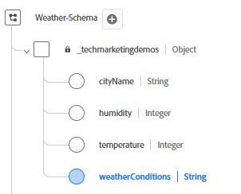

# Set Up XDM Schema, Dataset and Datastream in AEP

## Create XDM Schema

To use the Adobe Experience Platform Web SDK (Alloy.js) on a web page, AEP Tags must be associated with a Datastream that is mapped to an XDM Event Schema. The Web SDK (alloy.sendEvent) sends data into AEP as Experience Events, which must conform to an XDM schema based on the XDM ExperienceEvent class.

To create an XDM schema

*   Log in to Adobe Experience Platform
*   Data Management -> Schemas -> Create schema

*   Create an XDM event based schema called **_Weather-Schema_**. If you are not familiar with creating a schema, please follow this [documentation](https://experienceleague.adobe.com/en/docs/experience-platform/xdm/tutorials/create-schema-ui)

*   Make sure that the schema has the following fields with appropriate data type.

## Create a Dataset Based on the Schema

A **dataset in Adobe Experience Platform (AEP)** is a structured storage container used to ingest, store, and activate data based on a defined XDM schema.

*   Data Management -> Datasets -> Create dataset
*   Create a dataset called **_Weather-schema-dataset_** based on the XDM schema(_**Weather-Schema**_) created in the previous step.

## Create a Datastream

A datastream in Adobe Experience Platform is like a secure pipeline (or highway) that connects your website or app to Adobe services, allowing data to flow in and personalized content to flow back.

*   Navigate to Data Collection > Datastreams, then click New Datastream. Name the datastream **weather-related-datastream**

*   Provide the following details as shown in the screenshot below

*   Click Save, then click on Add Mapping and add the Adobe Experience Platform service and the event Dataset with appropriate check boxes selected

*   Save the datastream.
