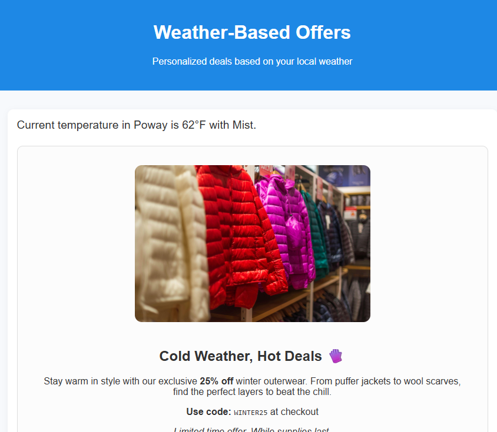

# Use case description

Using weather-related data in Adobe Journey Optimizer (AJO) to serve offers allows businesses to personalize customer experiences based on real-world, real-time environmental conditions. Weather is a powerful contextual signal. People's needs and behavior shift depending on the weather. By using weather data:

Deliver relevant offers that align with customer mood and environment

On a hot day, show an offer for cold beverage or AC units. On a rainy day, promote jackets or umbrella's

Example of on weather based offer

    

## Pre-requisites for this tutorial

*   Access to Experience Platform.

*   Basic understanding of Adobe Experience Platform Tags.

*   Basic understanding of Experience Platform concepts (Profiles, Audiences, Datasets).

*   Familiarity with Journey Optimizer.

*   Basic JavaScript knowledge (reading and writing simple functions).

*   Ability to use Browser DevTools (Console and Network tabs).
