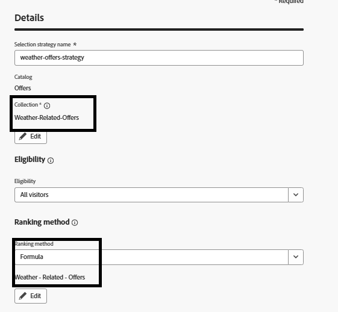

# Create a selection strategy

A selection strategy is a reusable configuration that combines a collection of offers with eligibility rules and a ranking method to determine which offers are shown when the strategy is used in a decision policy.

To create a selection strategy

*   Log in to Journey Optimizer

*   Navigate to Decisioning ->Strategy setup ->Selection strategies ->Create selection strategy

*   Provide Selection strategy name, Collection, Eligibility and Ranking method as shown in the screenshot

Make sure to use formula as the ranking method

