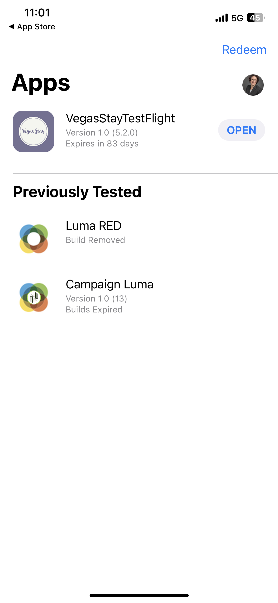

# Summit Lab L731 - Cheat Sheet

This page has text and links that are being used in the L731 Summit Lab. It allows you to copy and paste the content into your Journey Optimizer messages. 

## Exercise 1.1 - Download and install the app

Scan the QR code to download the app 

>[!BEGINTABS]

>[!TAB iOS]

You will be asked to install Testflight, steps 1 to 4. Once you have installed Testflight follow steps 5 to 8 to install the Vegas Stay App:

<table>
<tr>
</tr>
<tr>
<td>
 

      

      <b>Step 1 </b>
      

      
      

  </td>
  <td>
 

      

      <b>Step 2 </b>
      

      
      

  </td>
  <td>
 

      

      <b>Step 3 </b>
      

      
      

  </td>
  <td>
 

      

      <b>Step 4 </b>
      

      
      

  </td>
  </tr>
  <tr>
<td>
 

      

      <b>Step 5 </b>
      

      
      

  </td>
  <td>
 

      

      <a>
      <b>Step 6 </b>
      

        
      </a>
      

  </td>
  <td>
 

      

      <a>
      <b>Step 7 </b>
      

        
      </a>
      

  </td>
  <td>
 

      

      <a>
      <b>Step 8 </b>
      

        
      </a>
      

  </td>
  </tr>
</table>

>[!TAB Android]

As the app is not registered with the Google Play Store, you will receive a warning message:

Click **Install anyway**

>[!ENDTABS]

## Exercise 1: Log in to Adobe Journey Optimizer

[Click here to log in to Journey Optimizer](https://experience.adobe.com/#/@techmarketingdemos/sname:summit-2023-ajo-lab/journey-optimizer/home)

**Login Details:**

* **Username:** `L731+<your seat number>@summitlab.us` (example: L731+001@summitlab.us)
* **Password:** Adobe2023!

## Exercise 2 Create an In-App Campaign

|Field|Text|Links|
|----|----|----|
|Campaign Name| `<your seat number> Vegas Stay Campaign`||
|Matcher|booknow||
|Media URL option||https://i.ibb.co/NstLhjW/Firefly-Poster-with-heading-Adobe-Max-84773.jpg|
|Title|Get your early bird discount!||
|Body|Adobe Max returns to Las Vegas. Get ready for inspiring speakers, skill-expanding sessions, and new connections. Book your suite now and get 10% off.||
|Button|Get your 10% discount!|lab://booking?suite=presidential&discount=10|
|Button: Interactive event|In-app CTA||
|Base URL to be used for preview on device||**iOS:** lab://  **Android**: https://lab|

## Exercise 3: Create a Push Notification

|Field|Text|Links|
|----|----|----|
|Campaign Name| `<your seat number> Max Push Campaign`||
|Media URL option||https://i.ibb.co/1M0BnZn/Firefly-Big-conference-big-stage-with-ADBE-text-on-screen-40178.jpg| 
|Title|Hey!||
|Body|Did you know Adobe Max is coming back to Vegas. Book your room now and get 10% discount.||
