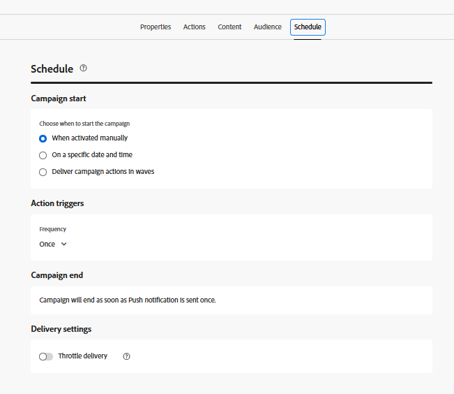

# Create Campaign

In this step, you will create a campaign in Adobe Journey Optimizer to send scheduled web push notifications to users who have opted in. The campaign targets an eligible audience and delivers messages at a predefined time, enabling planned and audience-based engagement.

* Log in to Journey Optimizer
* Navigate to Journey Management | Campaigns | Create Campaigns

## Specify  Campaign Settings

Specify the campaign name

## Associate Action with the campaign

Associate the push channel configuration created earlier in this tutorial

## Associate Audience with the campaign

Associate the audience `AudienceForPush` with the campaign

## Create content for the push notification

Create basic push content for testing the push notification. Specify title and body of the message as shown below

## Schedule the campaign

Schedule the campaign as per your needs

Finally make sure you activate the campaign.

## Test the campaign

To test the campaign, first enable notifications on the [web page by opting in](http://localhost:3000) when prompted. Once you have opted in, wait for the campaign to run at its scheduled time. When the campaign executes, you should receive the push notification in your browser.
