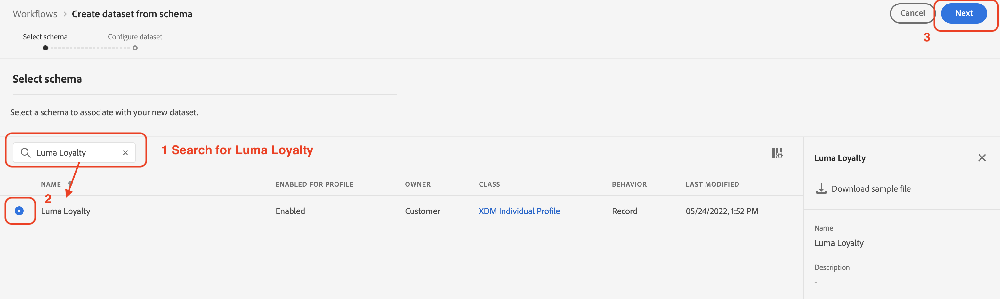

# Manual data ingestion

This section guides you through the required steps to create data sets and ingest sample data

>[!TIP]
>
> Watch the video tutorial [Create datasets and ingest data](/help/set-up-data/create-datasets-and-ingest-data.md) before you begin.

 You will create five [!UICONTROL datasets] based on the Luma [!UICONTROL schemas] you created in the [previous section](/help/tutorial-configure-a-training-sandbox/manual-data-set-up.md). Once the datasets have been created you will ingest data from the JSON files you downloaded and modified (see [Introduction and prerequisites](/help/tutorial-configure-a-training-sandbox/introduction-and-prerequisites.md) section for instructions).

Follow the step by step instructions to create the first [!UICONTROL schema]:

1. Create a dataset named *[!DNL Luma Loyalty Data]* from [!DNL Luma Loyalty schema]
   1. From the left navigation, under [!UICONTROL DATA MANAGEMENT], select [!UICONTROL Datasets]
   1. Select [!UICONTROL Create dataset]
   
   1. On the next page select [!UICONTROL Create dataset from schema]
    
   1. On the next page search for the *[!DNL Luma Loyalty]* schema you created earlier
   1. Select *[!DNL Luma Loyalty]*
   1. Click [!UICONTROL Next]
    
   1. Configure the dataset:
      * Name: `Luma Loyalty Data`
   1. Click [!UICONTROL Finish]

    
  
2. Once the [!UICONTROL dataset] is created, you can ingest data into the dataset
   1. on the *[!DNL Luma Loyalty Data]* screen:

   1. Scroll down the the bottom of the right panel to the [!UICONTROL ADD DATA] section and enable
       * [!UICONTROL Error diagnostics] and
       * [!UICONTROL Partial ingestion]
        
   1. Drag and drop the *[!DNL luma-loyalty.json]* file to upload sample data to the dataset
   1. Refresh the page and check the batch status to confirm the file ingested correctly: 375 records should have been ingested. - It might take a couple of minutes for the data to be ingested.

>[!TIP]
>
>If the batch fails, make sure that you replaced the organization ID in the *[!DNL luma-loyalty.json]* file with your own organization's ID!

Next, create the fours additional [!UICONTROL datasets]:

| Dataset Name                         | From Schema                         | File to ingest              | Records |
| -------------------------------------| ----------------------------------- | ----------------------------| ------- |
| **`Luma CRM Data`**                | [!DNL Luma CRM]              | [!DNL luma-crm.json]        | 500     |
| **`Luma Products Data`**           | [!DNL Luma Products]                |  [!DNL luma-products.json]  | 92      |
| **`Luma Product Interactions Data`**| [!DNL Luma Product Interactions]    |   none     |  0    |
|**`Luma Product Inventory Events`** | [!DNL Luma Product Inventory Events]|    none     |  0  |

## Next

You have successfully created all required data sets and ingested the sample data. The final step is to **[configure events](/help/tutorial-configure-a-training-sandbox/configure-events.md)**.
