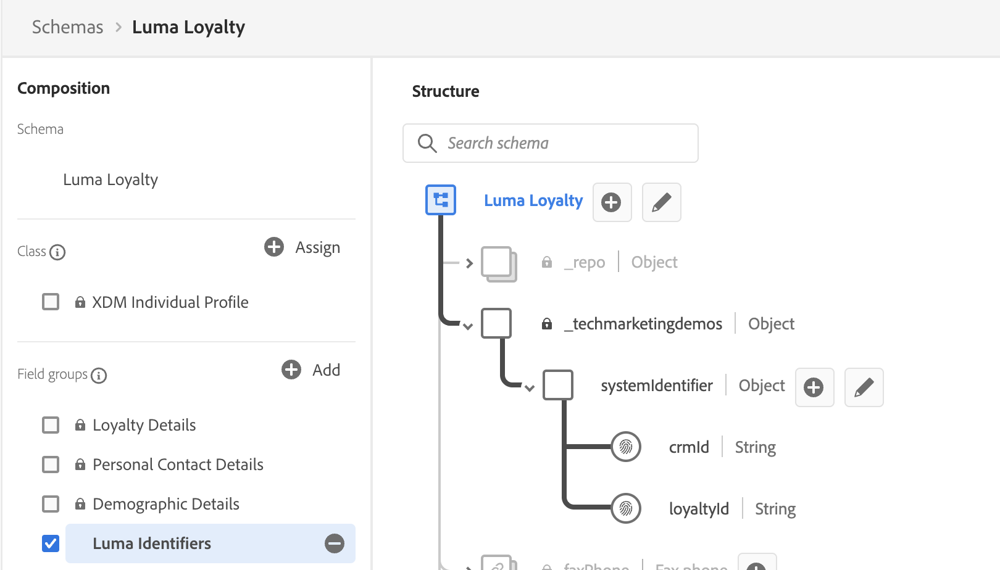
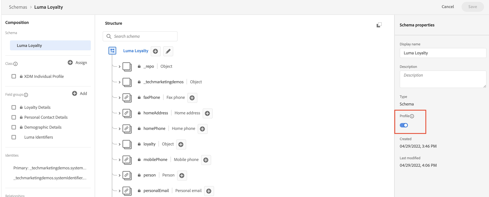

# Manual Data set-up

This section guides you through the manual data management configuration:

1. Create namespaces
2. Define the required structure of the data by creating the [[!UICONTROL schemas]](https://experienceleague.adobe.com/docs/experience-platform/xdm/schema/composition.html)
3. Ingest sample data

> [!TIP]
> Watch the video tutorial [Map identities](/help/set-up-data/map-identities.md) before you begin.

## Step 1: Create identity namespaces

In this step, you will create identity namespaces for Luma's custom identity fields, `loyaltyId`, `crmId`, and `lumaProduct`. Identity namespaces play a critical role in building real-time customer profiles, as two matching values in the same namespace allow two data sources to form an identity graph.

Let's start by creating a namespace for the Luma Loyalty Schema:

1. In the Platform user interface, go to **[!UICONTROL Identities]** in the left navigation
2. Select the **[!UICONTROL Create identity namespace]** button
3. Provide the following details:
   
   | Display Name | Identity Symbol | Type |
   |---|---|---|
   | Luma Loyalty ID | lumaLoyalty | Cross-device ID| 

4. Select **[!UICONTROL Create]**

    

Now create the following three namespaces following the same steps:

| Display Name | Identity Symbol | Type |
|---|---|---|
| Luma Loyalty ID | lumaLoyalty | Cross-device ID |
| Luma CRM ID | lumaCRM | Cross-device ID |
| Luma Product SKU | lumaProduct | Non-people identifier |

-----

## Step 2: Create [!UICONTROL Schemas]

In this step you will you will model Luma’s data into schemas.

> [!TIP]
> Watch the video tutorial: [Create a schema](help/set-up-data/create-schema.md) before you begin.

### Create the schema

Let's start by creating the [!DNL Luma Loyalty] schema:

1. Go to [!UICONTROL DATA MANAGEMENT] -> **[!UICONTROL Schemas]** in the left navigation
1. Select the **[!UICONTROL Create Schema]** button on the top right
1. From the dropdown menu, select **[!UICONTROL XDM Individual Profile]**, since we will be modeling attributes of an individual customer (points, status, and so on).

  

### Add field groups

Next you will be prompted to add field groups to the schema. All fields must be added to schemas using groups. You will be adding existing field groups and you will also need to create a new field group.

1. Add existing field groups

   1. If you aren't prompted and directy direceted to the schema page, select **[!UICONTROL Add]** under the **[!UICONTROL Schema Field Groups]** heading

      

   1. In the **[!UICONTROL Add Field groups]** modal, select following field groups:
      * **[!UICONTROL Demographic Details]** for basic customer data like name and birthdate
      * **[!UICONTROL Personal Contact Details]** for basic contact details like email address and phone number
      * **[!UICONTROL Loyalty Details]** for the loyalty details such as points, joind date, or status. The loyalty field group is far down the list, so it is easiest to search for it.
   1. Select **[!UICONTROL Add field group]** to add all three field groups to the schema.
   
      

1.  Create a **new [!UICONTROL field group]**
To help ensure consistency across the schemas,we will manage all system identifiers in a single group.
    1. From the middle [!UICONTROL Compostion] section, under [!UICONTROL Field groups], select **[!UICONTROL Add]**
    2. Select **[!UICONTROL Create new field group]**
    3. Use `Luma Identifiers` as the **[!UICONTROL Display name]**
    4. Use `system identifiers for XDM Individual Profile class` as the **[!UICONTROL Description]**
    5. Select **[!UICONTROL Add field groups]**
      

 1. Add fields to the **new [!UICONTROL field group]**
   The new, empty field group is added to your schema. With the + buttons you can add new fields to any location in the hierarchy. In our case we want to add fields at the root level:
   1. Select **[!UICONTROL +]** next to the name of the schema. This adds a new field  under your tenant id namespace to manage conflicts between your custom fields and any standard fields.
   2. In the **[!UICONTROL Field properties]** sidebar add the details of the new field:

-------------
---------------
      * [!UICONTROL Field name]: `systemIdentifier`
      * [!UICONTROL Display name]: `System Identifier`
      * [!UICONTROL Type]: `Object`
      * [!UICONTROL Assign field group]: `Luma identifiers`
   3. Select **[!UICONTROL Apply]**

      

Now add two fields under the `systemIdentifier` object:

   [!UICONTROL Fieldname] |[!UICONTROL Display Name]|[!UICONTROL Type]|
   |---------------------- |---------------------------|---------------------|
   | [!DNL Loyalty ID]      |[!DNL loyaltyId]         |[!UICONTROL String]|
   | [!DNL crmId]|[!DNL CRM Id] |[!UICONTROL String]|

   

   1. First field
      1. **[!UICONTROL Field name]**: `loyaltyId`
      2. **[!UICONTROL Display name:]** `Loyalty Id`
      3. **[!UICONTROL Type]**: **[!UICONTROL String]**
   2. Second field
      1. **[!UICONTROL Field Name]**: `crmId`
      2. **[!UICONTROL Display Name]**: `CRM Id`
      3. **[!UICONTROL Type]**: **[!UICONTROL String]**

----------
1.  Set identities
   1. Set **[!DNL LoyaltyID]** field as primary identity using **[!DNL Luma Loyalty ID]** [!UICONTROL Identity namespace]: [! DNL Loyalty ID] > [!UICONTROL Field properties] > [!UICONTROL Identity]: 
        
   2. Set [!DNL CRM ID] field as an identity using **[!DNL Luma CRM ID]** [!UICONTROL Identity namespace]
         
2.  Enable the [!DNL Luma Loyalty] schema for [!UICONTROL Profile]

   
13. Add the display name: **[!DNL Luma Loyalty]**
14. Save

Next, create the fours additional [!UICONTROL schemas]:

### Create [!UICONTROL Datasets]

In this step you will create five [!UICONTROL datasets] based on the [!UICONTROL schemas] you created in the previous step. Once the datasets have been created you will ingest data from the JSON files you downloaded and modified (see [Introduction and pre-requisites](/help/tutorial-configure-a-training-sandbox/introduction-and-pre-requisites.md) section for instructions).

> [!TIP]
> For more guidance on how to create [!UICONTROL datasets], watch the video tutorial: [Create datasets and ingest data](/help/set-up-data/create-datasets-and-ingest-data.md).

Follow the step by step instructions to create the first [!UICONTROL schema]: 

1. Create a dataset named *[!DNL Luma Loyalty Data]* from [!DNL Luma Loyalty schema]
   * From the left naviagtion select [!UICONTROL Datasets] > [!UICONTROL Create dataset] > [!UICONTROL Create dataset from schema]
   * Select *[!DNLLuma Loyalty]*
   * Click [!UICONTROL Next]
   * Name: [!DNL Luma Loyalty Data]
   * Click [!UICONTROL Finish]
  
2. Once the [!UICONTROL dataset], is created, scroll down in the right panel, enable [!UICONTROL Error diagnostics] and [!UICONTROL partial ingestion], and drag and drop the *[!DNL luma-loyalty.json]* file to upload sample data to the dataset
3. Check the batch status to confirm the file ingested correctly. It might take a couple of minutes for the data to be ingested - 375 records should have been ingested.

Next, create the fours additional [!UICONTROL datasets]:

| Dataset Name                         | From Schema                         | File to ingest              | Records |
| -------------------------------------| ----------------------------------- | ----------------------------| ------- |
| *[!DNL Luma Loyalty Data]* (done)    | *[!DNL Luma Loyalty schema]*        |  *[!DNL luma-loyalty.json]* | 375     |
| [!DNL Luma CRM Data]                 | [!DNL Luma CRM schema]              | [!DNL luma-crm.json]        | 500     |
| [!DNL Luma Products Data]            | [!DNL Luma Products]                |  [!DNL luma-products.json]  | 92      |
| [!DNL Luma Product Interactions Data]| [!DNL Luma Product Interactions]    |   [!DNL luma-crm.json]      | 500     |
| [!DNL Luma Product Inventory Events] | [!DNL Luma Product Inventory Events]|  [!DNL luma-crm.json]       | 500     |

#### Schemas

**Schema:*[!DNL Luma CRM]***

1. Add the following existing field groups:
* [!DNL Luma Identifiers]
* [!UICONTROL Demographic Details]
* [!UICONTROL Personal Contact Details]

2. Set identities:
* [!UICONTROL Primary indentity]:
   * [!DNL Luma Identifiers]: *[!DNL CRM ID]*, using *[!DNL Luma CRM ID]* namespace
* [!UICONTROL Indentity (not primary!)]
  *  [!UICONTROL Personal Contact Details]:
   * *[!DNL mobilePhone.number]*
      [!UICONTROL Identity namespace]: [!UICONTROL Phone]
   * *[!DNL personalEmail.address]* 
      [!UICONTROL Identity namespace]:[!UICONTROL Phone]
3. Enable the [!DNL XDM Profile] schema for Profile

### Luma Products

#### Create [!DNL Luma Products] Schema

1. Schemas > Create schema > Browse all schema types> Create new class
   * Display name: *[!DNL Luma Products] 
   * Assign class
2. Name the schema “Luma Products”
3. Create a new [!UICONTROL field group]
   * Display name: *[!DNL Luma Product Info]* 
   * Add [!UICONTROL field group]
4. Add a *[!DNL Product (product)]* object to the [!UICONTROL field group], and within the Product object add the following fields:
   * [!DNL SKU (string)]
   * [!DNL name (string)]
   * [!DNL category (string)]
   * [!DNL color (string)]
   * [!DNL size (string)]
   * [!DNL price (double)]
   * [!DNL description (string)]
   * [!DNL productImageURL (string)]
   * [!DNL productURL (string)]
   * [!DNL stockQuantity (long)]
5. Save schema

##### Create [!Luma Products Dataset]

1. Create dataset named *[!DNL Luma Products Data] from *[!DNL Luma Products] schema
   * [!UICONTROL Datasets] > [!UICONTROL Create dataset] > [!UICONTROL Create dataset from schema]
2. Once the dataset is created, scroll down in the right panel, enable [!UICONTROL error logs] and [!UICONTROL partial ingestion], and drag and drop the *[!DNL luma-products.json]* file to upload sample data to the dataset
3. Check the [!UICONTROL batch status] to confirm the file ingested correctly - 92 records should have been ingested.

### Luma Product Interactions

#### Create [!DNL Luma Products Interactions] Schema

1. [!UICONTROL Schemas] > [!UICONTROL Create schema] > [!UICONTROL XDM Experience Event]
   * [!UICONTROL Display Name]: *[!DNL Luma Product Interactions]*
2. Add the following field groups:
   * [!DNL Luma Identifiers]
   * [!UICONTROL Demographic Details]
   * [!UICONTROL Personal Contact Details]
3. Set [!DNL CRM ID] field as [!UICONTROL primary identity} using [!DNL Luma CRM ID] [!UICONTROL namespace]
4. Set *[!DNL personalEmail.address]* and *[!DNL mobilePhone.number]* as [!UICONTROL  identities] using the standard [!UICONTROL Email] and [!UICONTROL Phone] [!UICONTROL namespaces], respectively.
5. [!UICONTROL Enable for Profile] and save

##### Create [!DNL Luma Product Interactions Data] Dataset

1. Create dataset named *[!DNL Luma Product Interactions Data] from *[!DNL Luma Product Interacticons] schema
   * [!UICONTROL Datasets] > [!UICONTROL Create dataset] > [!UICONTROL Create dataset from schema]
2. Once the dataset is created, scroll down in the right panel, enable [!UICONTROL error logs] and [!UICONTROL partial ingestion], and drag and drop the *[!DNL luma-crm.json]* file to upload sample data to the dataset
3. Check the [!UICONTROL batch status] to confirm the file ingested correctly - 500 records should have been ingested.

### Luma Product Inventory Events

#### Create [!DNL Luma Product Inventory Events] Schema

1. [!UICONTROL Schemas] > [!UICONTROL Create schema] > [!UICONTROL Browse] > [!UICONTROL Create new class]
   * [!UICONTROL Display Name]: *[!DNL Luma Product Inventory Events]*
2. Add the following field groups:
   * [!DNL Luma Identifiers]
   * [!UICONTROL Demographic Details]
   * [!UICONTROL Personal Contact Details]
3. Set [!DNL CRM ID] field as [!UICONTROL primary identity} using [!DNL Luma CRM ID] [!UICONTROL namespace]
4. Set *[!DNL personalEmail.address]* and *[!DNL mobilePhone.number]* as [!UICONTROL  identities] using the standard [!UICONTROL Email] and [!UICONTROL Phone] [!UICONTROL namespaces], respectively.
5. [!UICONTROL Enable for Profile] and save

##### Create [!Luma Product Inventory Events] Dataset

1. Create dataset named *[!DNL Luma Product Inventory Events] from *[!DNL Luma Product Inventory Events] schema
   * [!UICONTROL Datasets] > [!UICONTROL Create dataset] > [!UICONTROL Create dataset from schema]
2. Once the dataset is created, scroll down in the right panel, enable [!UICONTROL error logs] and [!UICONTROL partial ingestion], and drag and drop the *[!DNL luma-crm.json]* file to upload sample data to the dataset
3. Check the [!UICONTROL batch status] to confirm the file ingested correctly - 500 records should have been ingested.
