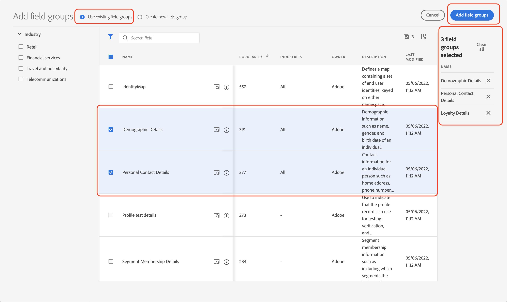

# Set up data manually

Learn about manual data management and configuration. You can create the required identity namespaces and define the [!DNL Luma] sample data structure by creating the [[!UICONTROL schemas]](https://experienceleague.adobe.com/docs/experience-platform/xdm/schema/composition.html)

>[!TIP]
>Watch the video tutorial [Map identities](/help/set-up-data/map-identities.md) before you begin.

## Step 1: Create identity namespaces

In this step, you create identity namespaces for the [!DNL Luma] custom identity fields named `loyaltyId`, `crmId`, and `lumaProduct`. Identity namespaces play a critical role in building real-time customer profiles, as two matching values in the same namespace allow two data sources to form an identity graph.

Begin by creating a namespace for the [!DNL Luma] loyalty schema:

1. In the Platform user interface, go to **[!UICONTROL Identities]** in the left navigation.

1. Select **[!UICONTROL Create identity namespace]**.

1. Provide the following details:

   | Display Name | Identity Symbol | Type |
   |---|---|---|
   | `Luma Loyalty ID` | `lumaLoyalty` | [!UICONTROL Cross-device ID]|

1. Select **[!UICONTROL Create]**.

   

1. Create two more namespaces following the same steps:

   | Display Name | Identity Symbol | Type |
   |---|---|---|
   | `Luma CRM ID` | `lumaCRM` | [!UICONTROL Cross-device ID] |
   | `Luma Product` | `lumaProduct` |[!UICONTROL Non-people identifier]|

## Step 2: Create schemas

In this step, you define the required structure of the data by creating the five required [[!UICONTROL schemas]](https://experienceleague.adobe.com/docs/experience-platform/xdm/schema/composition.html):

* [[!DNL Luma Loyalty]](#create-luma-loyalty-schema)

* [[!DNL Luma Products]](#create-luma-products-schema)

* [[!DNL Luma Product Inventory Events]](#create-luma-product-inventory-event-schema)

* [[!DNL Luma CRM]](#create-luma-crm-and-luma-product-interactions-schemas)

* [[!DNL Luma Product Interactions]](#create-luma-crm-and-luma-product-interactions-schemas)

>[!TIP]
>
>Watch the video tutorial: [Create a schema](/help/set-up-data/create-schema.md) before you begin.

### Create [!DNL Luma Loyalty] [!UICONTROL Schema] {#create-luma-loyalty-schema}

#### Create the schema

Begin by creating the [!DNL Luma Loyalty] schema:

1. Go to **[!UICONTROL DATA MANAGEMENT]** > **[!UICONTROL Schemas]** in the left navigation.

1. Select **[!UICONTROL Create Schema]** on the top right.

1. From the dropdown menu, select **[!UICONTROL XDM Individual Profile]**, since you are modeling attributes of an individual customer (points, status, and so on).

   

#### Add existing field groups

Next you are prompted to add field groups to the schema. You must add all fields to schemas using groups. You are adding existing field groups and must create a field group.

>[!NOTE]
>
>If the [!UICONTROL Field groups] modal doesn't automatically open on the [!UICONTROL Schemas] page, select **[!UICONTROL Add]** (as shown in the following image).

1. On the **[!UICONTROL Add Field groups]** page, enable the following field groups:

   * **[!UICONTROL Demographic Details]** for basic customer data like name and birth date.
   
   * **[!UICONTROL Personal Contact Details]** for basic contact details like email address and phone number.
   
   * **[!UICONTROL Loyalty Details]** for the loyalty details such as points, joined date, or status. The loyalty field group is far down the list, so it is easiest to search for it.

1. Select **[!UICONTROL Add field group]** to add all three field groups to the schema.

   

1. Select the top node of the schema.

1. Enter `Luma Loyalty` as the [!UICONTROL Display name].

#### Create a [!UICONTROL field group]

To help ensure consistency across the schemas, Adobe recommends managing all system identifiers in a single group:

1. From the **[!UICONTROL Composition]** section under [!UICONTROL Field groups], select **[!UICONTROL Add]**.

1. Select **[!UICONTROL Create new field group]**.

1. Add `Luma Identifiers` as the **[!UICONTROL Display name]**.

1. Add `system identifiers for XDM Individual Profile class` as the **[!UICONTROL Description]**.

1. Select **[!UICONTROL Add field groups]**.

   

#### Add fields to the new [!UICONTROL field group]

The new, empty field group is added to your schema. Using the + buttons, you can add new fields to any location in the hierarchy. In this case, you must add fields at the root level:

1. Select **[!UICONTROL +]** next to the name of the schema. 

   This step adds a field under **your tenant id** namespace, to manage conflicts between your custom fields and any standard fields.

1. In the **[!UICONTROL Field properties]** sidebar, add the details of the new field:

   * **Field name:** `systemIdentifier`

   * **[!UICONTROL Display name]:** `System Identifier`

   * **Type:** Object

   * **[!UICONTROL Assign field group]:** [!DNL Luma identifiers]

1. Select **[!UICONTROL Apply]**.

   

   Add two fields under the `systemIdentifier` object:

   |[!UICONTROL Fieldname] |[!UICONTROL Display Name]|[!UICONTROL Type]|
   |-------------|-----------|----------|
   | `loyaltyId`|`Loyalty ID`|[!UICONTROL String]|
   | `crmId`| `CRM Id`|[!UICONTROL String]|

#### Set identities

You now have the namespace and the [!DNL Luma] Loyalty schema configured. Before you can ingest data, you must label the identity fields. Each schema used with [!UICONTROL Real-time Customer Profile] is required to have a primary identity specified and each record ingested must have a value for that field.

1. Set the **primary Identity**:

   From the `Luma Loyalty` schema:

   1. Select the `Luma Identifiers` field group.

   1. Select the `loyaltyId` field.
   
   1. In the **[!UICONTROL Field properties]**, enable the **[!UICONTROL Identity]** box.
   
   1. Enable the **[!UICONTROL Primary Identity]** box.
   
   1. Select the `Luma Loyalty Id` namespace from **[!UICONTROL Identity namespaces]** dropdown.
   
   1. Select **[!UICONTROL Apply]**.

      

1. Set a **secondary identity**:

   From the `Luma Loyalty` schema:
   
    1. Select the `Luma Identifiers` field group.
   
    2. Select the `crmId` field.
   
    3. In the **[!UICONTROL Field properties]**, enable the **[!UICONTROL Identity]** box.
   
    4. Select the `Luma CRM Id` namespace from **[!UICONTROL Identity namespaces]** dropdown.
   
    5. Select **[!UICONTROL Apply]**.
  
#### Enable for profile and save the schema

1. Select the top node of the schema.

1. In the [!UICONTROL Field properties] enable **[!UICONTROL Profile]**.

   The schema should look like this:

   

1. Select **[!UICONTROL Save]**.

### Create [!DNL Luma Products] [!UICONTROL Schema] {#create-luma-products-schema}

1. Go to [!UICONTROL DATA MANAGEMENT] -> **[!UICONTROL Schemas]** in the left navigation.

1. Select the **[!UICONTROL Create Schema]** button on the top right.

1. From the dropdown menu, select **[!UICONTROL Browse all schema types]**, which allows you to create a class.

1. Select **[!UICONTROL Create new class].

1. Add the display name: `Luma Products`.

1. Assign class.

1. Create a [!UICONTROL field group]:

   * Display name: `Luma Product Info`

1. Add the following field to the [!DNL Luma] [!UICONTROL Product] Info field group.

   * Field name: `product`

   * Display name: `Product` 

   * Type: [!UICONTROL Object] 

   * Field group: [!DNL Luma Product info]

1. Select **[!UICONTROL Apply]**.

1. Add the following fields to the **[!DNL Product]** object: 

   | [!UICONTROL Fieldname] |[!UICONTROL Display Name]|[!UICONTROL Type]|
   |-------------|-----------|----------|
   | `sku`|`SKU`|[!UICONTROL String]|
   | `name`| `Name`|[!UICONTROL String]|
   | `category`| `Category`|[!UICONTROL String]|
   |`color`|`Color`|[!UICONTROL String]|
   |`size`|`Size`| [!UICONTROL String]|
   |`price`|`Price`| [!UICONTROL Double]|
   |`description`|`Description`|[!UICONTROL String]|
   |`productImageURL`|`Product Image URL`|[!UICONTROL String]|
   |`productURL`|`Product URL`| [!UICONTROL String]|
   |`stockQuantity`|`Stock Quantity`| [!UICONTROL String]|

1. Add the **[!UICONTROL Display name]** `Luma Products` to the schema.

1. Select **[!UICONTROL Save]**.

### Create [!DNL Luma Product Inventory Event] [!UICONTROL Schema] {#create-luma-product-inventory-event-schema}

1. Go to **[!UICONTROL DATA MANAGEMENT]** -> **[!UICONTROL Schemas]** in the left navigation.

1. Select the **[!UICONTROL Create Schema]** button on the top right.

1. From the dropdown menu, select **[!UICONTROL Browse all schema types]**.

1. Select **[!UICONTROL Create new class]**.

1. Add the display name: `Business Event`.

1. Select type: *[!UICONTROL Time-series]*.

1. Assign class.

1. Create a [!UICONTROL field group]:

   * Display name: `Product Inventory Event Details`

1. Add the **[!UICONTROL Display name]** `Luma Product Inventory Event Schema` to the schema.

1. Add the following field to the Luma Product Info field group:

   * Field name: `inventoryEvent`

   * Display name: `Inventory Event` 

   * Type: [!UICONTROL Object] 

   * Field group: [!DNL Product Inventory Event Details]

1. Add the following fields to the **[!DNL Product Inventory Event Details]** object:

   | [!UICONTROL Fieldname] |[!UICONTROL Display Name]|[!UICONTROL Type]|
   |-------------|-----------|----------|
   | `productId`| `Product ID`|[!UICONTROL String]|
   | `sku`|`SKU`|[!UICONTROL String]|
   | `stockEventType`| `Stock Event Type`|**[!UICONTROL Enum]** with `restock` and `outOfStock` as values |

   1. to set the `stockEventType` to Enum, select type: `string`.

   1. Scroll down to the bottom of the **[!UICONTROL Field properties]**.

   1. Enable **[!UICONTROL Enum]**.

   1. Enter **[!UICONTROL values] ([!UICONTROL label)]**: `restock` (`restock`).

   1. Select **[!UICONTROL Add row]**.

   1. Enter **[!UICONTROL values] ([!UICONTROL label)]**: `outOfStock` (`out of stock`).

   1. Select **[!UICONTROL Apply]**.

      

1. Set `productId` field as **[!UICONTROL primary identity]** using **[!DNL Luma Product namespace]**.

1. Select the `sku` field and define a relationship to the `product.sku` field in the **[!DNL Luma Products]** Schema:

   1. Scroll down to the bottom of the **[!UICONTROL Field properties]**.

   1. Enable **[!UICONTROL Relationship]**.

      1. **[!UICONTROL Reference schema]**: [!DNL Luma Products].

      1. **[!UICONTROL Reference identity namespace]**: [!DNL Luma Product].

   1. Select **[!UICONTROL Apply]**.

      The schema should look like this:

      

1. Enable for **Profile**.

1. Select [!UICONTROL Save] to save the schema.

### Create the [!DNL Luma CRM] and [!DNL Luma Product Interactions] schemas {#create-luma-crm-and-luma-product-interactions-schemas}

Create the following additional [!UICONTROL schemas]:

|[!UICONTROL Display name]|[!DNL Luma CRM]| [!DNL Luma Product Interactions] |
|  ---| ------- | ---- |
|  **[!UICONTROL Type]**| [!UICONTROL XDM Individual Profile]| [!UICONTROL XDM Experience Event]|
|  **[!UICONTROL Add existing field group]**| Luma Identifiers Demographic Details Personal Contact Details | Identity Map Commerce Details|
|  **[!UICONTROL Relationship]**||*[!DNL productListItems.SKU]*:  Reference schema *[!DNL Luma Products]*  [!DNL Reference identity namespace] *[!DNL Luma Product]* schema|
|  **[!UICONTROL Primary Identity] [!UICONTROL namespace])** | systemIdentifier.crmId (Luma CRM Id)| |
|  **[!UICONTROL Secondary Identity][!UICONTROL namespace]** | personalEmail.address (Email) mobilePhone.number (Phone)| |
|   **[!UICONTROL Enable for profile]**| yes | yes |

## Next steps

Now that you have created the data structure, you [create data sets and ingest sample data](/help/tutorial-configure-a-training-sandbox/manual-data-ingestion.md).
