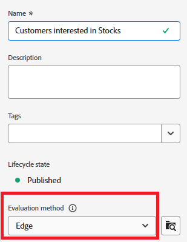

# Creating Audiences in Adobe Journey Optimizer

Audiences in Adobe Experience Platform are groups of users created based on their actions, preferences, or profile information to deliver personalized experiences.

* Log in to Journey Optimizer
* Navigate to Customer -> Audiences ->Create audience
* Create Audiences using the Build Rule method
 
   

*   Create the following 3 Audiences 

    *   Customers Interested in Stocks

    *   Customers Interested in Bonds

    *   Customers Interested in CD

*   Ensure that the evaluation method for each audience is set to _**Edge**_ for real-time qualification.

*   Use the PreferredFinancialInstrument field to segment users based on their selected investment interest—such as Stocks, Bonds, or CDs

 

>[!NOTE]
>
>>If the PreferredFinancialInstrument field is not visible in the events tab, click the settings icon and toggle the Show the full XDM schema.

