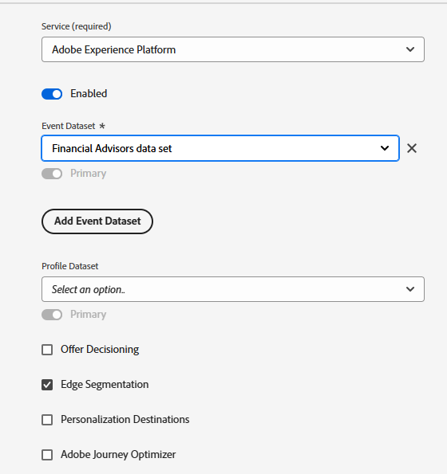

# Set Up XDM Schema,Dataset and Datastream in AEP

## Create XDM Schema

*   Log in to Adobe Experience Platform
*   Data Management -> Schemas -> Create schema

*   Create an XDM event based schema called _Financial Advisors_. If you are not familiar with creating a schema, please follow this [documentation](https://experienceleague.adobe.com/en/docs/experience-platform/xdm/tutorials/create-schema-ui)

*   Add the following structure to your schema. The PreferredFinancialInstrument element stores the user's preference for Stocks, Bonds, CD. The **__techmarketingdemos_** is the tenant id, and will be different in your environment.

*   The PreferredFinancialInstrument element has enum values defined as shown below

*   Make sure that the schema is enabled for the profile.

## Create a Dataset Based on the Schema

A **dataset in Adobe Experience Platform (AEP)** is a structured storage container used to ingest, store, and activate data based on a defined XDM schema.

*   Data Management -> Datasets -> Create dataset
*   Create a dataset called _Financial Advisors data set_ based on the XDM schema(Financial Advisors) created in the previous step.

*   Make sure that the dataset is enabled for profile

## Create a Datastream

A datastream in Adobe Experience Platform is like a secure pipeline (or highway) that connects your website or app to Adobe services, allowing data to flow in and personalized content to flow back.

*   Data Collection > Datastreams, then click New Datastream. Name the datastream _Financial Advisors DataStream_

*   Provide the following details as shown in the screenshot below

*   Click Save, then click on Add Mapping and add the Adobe Experience Platform service and the event Dataset as shown

*   Choose the appropriate event dataset (created earlier).

*   Save the datastream

