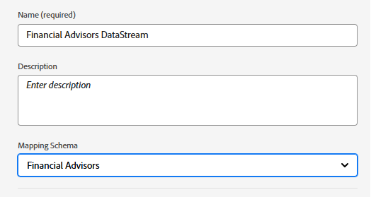

# Set Up XDM Schema,Dataset,Datastream and Audiences in AEP

*   Log in to Adobe Experience Platform

*   Create an XDM event based schema called Financial Advisors in Journey Optimizer. If you are not familiar with creating a schema, please follow this [documentation](https://experienceleague.adobe.com/en/docs/experience-platform/xdm/tutorials/create-schema-ui)

*   Add the following structure to your schema. The PreferredFinancialInstrument element stores the user's preference for Stocks, Bonds, CD

*   The PreferredFinancialInstrument element has enum values defined as shown below

*   Make sure that the schema is enabled for the profile.

## Create a Dataset Based on the Schema

A **dataset in Adobe Experience Platform (AEP)** is a structured storage container used to ingest, store, and activate data based on a defined XDM schema.

*   Create a dataset called _Financial Advisors data set_ based on the XDM schema(Financial Advisors) created in the previous step.

*   Make sure that the dataset is enabled for profile

## Create a Datastream

A datastream in Adobe Experience Platform is like a secure pipeline (or highway) that connects your website or app to Adobe services, allowing data to flow in and personalized content to flow back.

*   Go to AEP > Datastreams, then click New Datastream. Name the datastream _Financial Advisors DataStream_

*   Provide the following details as shown in the screenshot below

*   Click Save, then click on Add Mapping and add the Adobe Experience Platform service and the event Dataset as shown

*   Choose the appropriate event dataset (created earlier).

*   Save the datastream

## Create Audiences

Audiences in Adobe Experience Platform are groups of users created based on their actions, preferences, or profile information to deliver personalized experiences.

*   Navigate to Customer -> Audiences
*   Create Audiences using the Build Rule method

*   Create the following 3 Audiences in AJO using the PreferredFinancialInstrument element from the event schema.

    *   Customers Interested in Stocks

    *   Customers Interested in Bonds

    *   Customers Interested in CD

Ensure that the evaluation method for each audience is set to Edge for real-time qualification.

The following screenshots should help you in creating the Audiences.

