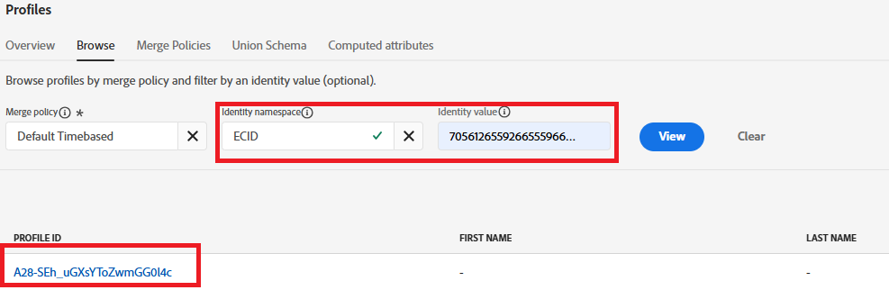

# Testing the solution

To validate your implementation, start by opening the web page containing your preference form. Use the browser's DevTools (Console and Network tabs) to monitor the form submission process. After submitting a preference (for example, selecting "Stocks"), confirm that the AEP Web SDK (alloy.sendEvent) successfully triggers and that the correct data is sent to Adobe Experience Platform. In AEP, navigate to the Audiences section and verify that your profile qualifies for the expected audience (for example, "Interested in Stocks") within a few moments, using Edge Segmentation. You can also inspect the incoming event data in the associated dataset to ensure it contains the correct preference value. Repeating this process for each asset class (Stocks, Bonds, CDs) to ensure that the full workflow is functioning correctly.

## Troubleshooting Tips

If you do not see the profile qualify for the intended audience immediately, verify the following:

### Validate Adobe Data Layer Push

* Open the browser's Developer Tools → Console
* Type console.log(window.adobeDataLayer);
* Confirm that an event with event: "assetClassSelection" and the correct PreferredFinancialInstrument value appears after form submission

### Confirm Launch Rule Execution

* Open the Adobe Experience Platform Debugger (Chrome Extension)
* Sign in to the debugger
* Submit the form
* Verify that the DataPushed event for assetClassSelection is captured

The following debugger screenshot should help you

### Get the ECID

The ECID (Experience Cloud ID) is Adobe's unique, persistent identifier used to recognize and unify users across Experience Cloud solutions and sessions.

*   Chrome Developer Tools → Network tab

*   Filter by "interact" or "collect"

*   Submit the form
*   Click the Response tab and make a note of the ECID

### Check Real-Time Profile and Audience Qualification

*   Log in to Journey Optimizer
*   Go to Customers->Profiles->Browse
*   Search for ECID you got from the previous step as shown in the screenshot

*   Click on the profile and select the events tab to check if investment_preference_event is listed

*   Open the json associated with the event and check if it contains the correct event data.

### Additional Troubleshooting Tips

* Make sure that the schema and dataset profile are enabled.
* Ensure that Edge Segmentation is enabled for the audience so that qualification happens in near real-time.
* Waiting a few minutes and refreshing the Audiences view can also help, especially if testing right after publishing changes.
* Make sure that audience rules are correctly defined and reference the exact field names and values captured from the form submission.
