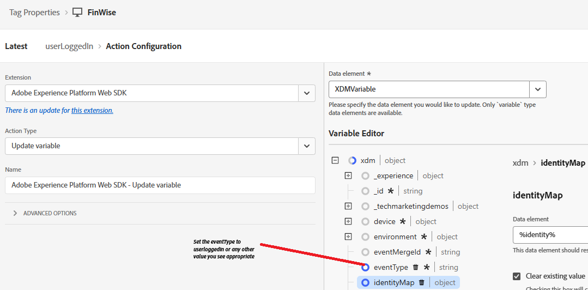

# Send CRMID to Adobe Experience Platform

Adobe Experience Platform Tags is used to send the CRMID to Adobe Experience Platform (AEP) because it provides a flexible, event-driven mechanism for transmitting identity data directly from the browser. Sending CRMID after user login allows AEP to link the anonymous ECID with the known CRM profile, enabling accurate identity stitching. This linkage forms the foundation for building unified customer profiles, qualifying audiences, and delivering real-time personalized experiences in Adobe Journey Optimizer (AJO).

An Experience Platform Tags property called _**FinWise**_ is created. The following extensions were added to the Tags property

Configure the AEP Web SDK extension using the Financial Advisors DataStream created in the previous step.
Experience Cloud ID Service is an optional extension added to the tag property for debugging purposes.

## Tag Data Elements

Create the following Data Elements

| Data Element | Extension                         | Data Element Type         | Custom Settings                        |
|--------------|-----------------------------------|---------------------------|----------------------------------------|
| crmid        | Adobe Client Data Layer           | Data Layer Computed State | user.crmid                             |
| ECID         | Experience Cloud ID Service       | ECID                      |                                        |
| identity     | Adobe Experience Platform Web SDK | Identity map              |  |
| XDMVariable  | Adobe Experience Platform Web SDK | Variable                  |        |

## Create Rule

Create a rule called userLoggedin with the following event and actions

Event

Update Variable Action

Send Event Action

## Save and Build

Save your changes, create and build the library.
