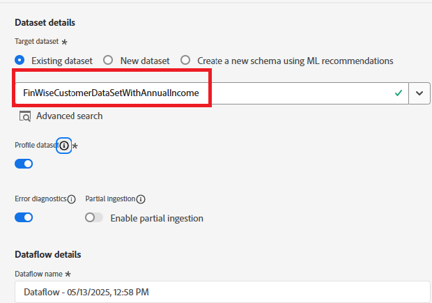

# Import sample CRM data into AEP profile dataset

To begin the identity stitching, import sample CRM profile data into a dataset tied to a profile-enabled schema in Adobe Experience Platform

## Create a custom namespace

* Navigate to Customer -> Identities -> Create identity namespace
* Select Individual cross-device ID and provide the display name and identity symbol as shown in the screen-shot below.

## Create a profile enabled schema

Create an individual profile schema called **_FinWiseProfileSchema_**. Include fields, such as annualIncome, email,firstName,lastName and loyaltyStatus.
Add an identity field **_crmid_** under the SystemIdentifier object. Mark the crmid field as identity and primary

## Prepare sample data

| crmId  | firstName | lastName | email                     | loyaltyStatus | annualIncome |
|--------|-----------|----------|---------------------------|---------------|--------------|
| FIN001 | Alice     | Wong     | alice.wong@example.com    | Gold          | 336104       |
| FIN002 | Brian     | Smith    | brian.smith@example.com   | Silver        | 191065       |
| FIN003 | Cathy     | Johnson  | cathy.johnson@example.com | Bronze        | 117015       |
| FIN004 | David     | Lee      | david.lee@example.com     | Bronze        | 61869        |
| FIN005 | Eva       | Martinez | eva.martinez@example.com  | Silver        | 191371       |
| FIN006 | Frank     | Brown    | frank.brown@example.com   | Silver        | 196132       |
| FIN007 | Grace     | Kim      | grace.kim@example.com     | Gold          | 309851       |
| FIN008 | Henry     | Davis    | henry.davis@example.com   | Gold          | 318378       |
| FIN009 | Isla      | Clark    | isla.clark@example.com    | Silver        | 181776       |
| FIN010 | Jack      | Lopez    | jack.lopez@example.com    | Silver        | 186643       |

## Ingest the CSV file

* Create a dataset called **_FinWiseCustomerDataSetWithAnnualIncome_** based on the **_FinWiseProfileSchema_** created in the earlier step

* Navigate to Connections -> Sources -> Local system
* Select the **_Add Data_** under the Local file upload. Make sure to select the _**FinWiseCustomerDataSetWithAnnualIncome**_ as the target dataset.

* Navigate to the next screen. Upload the [csv file](assets/sample_crm_data.csv) and verify the mappings 

* Click Finish to start the data ingestion process

## Verify profile

* Navigate to Customer ->Profiles and search for FinWise CRM ID equal to FIN001 or any other valid value

