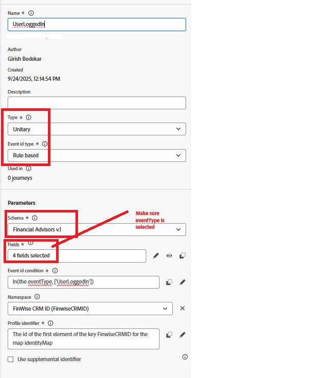

# Trigger Adobe Journey Optimizer Journey using Adobe Web SDK

In this extension of the Identity Stitching tutorial, Adobe Journey Optimizer journey is triggered that emails the logged-in user using their stitched profile. **This article assumes you are familiar with the e-mail channel and  creating content for the e-mail channel.**

## Create E-mail channel configuration

* Log in to _**Journey Optimizer**_
* Navigate to _**Administration -> Channels -> Create channel configuration**_
* Select **Email** from the channel list. Provide a meaningful name and description.
* Fill out the email settings.
* Provide execution details as shown below. The email is sent to the profile's email address stored in the field
* 
* Activate the Email channel configuration

## Create Event

*   Log in to _**Journey Optimizer**_
*   Navigate to _**Administration -> Configurations**_
*   Click on the Manage button of the Events card and click on Create Event. Specify the values as shown below
*   

*   Check whether the event's eventType equals UserLoggedIn. In this case for simplicity the event name and event type are the same.`in(@event{event1.eventType}, ['UserLoggedIn'])`
*   Save the event

## Create Journey

* Log in to _**Journey Optimizer**_
* Navigate to _**Journey Management -> Journeys -> Create Journey**_
* Drag and drop the _**UserLoggedIn**_ event on to the canvas
* Drag and drop Email from the actions menu. Configure the email action to use the email channel configuration created earlier
* Publish the journey

## How the journey is triggered
>[!NOTE]
>
> The journey is triggered when the event payload sent via the Web SDK, matches what is configured in the journey. In this example, the event and event type is **UserLoggedIn**

