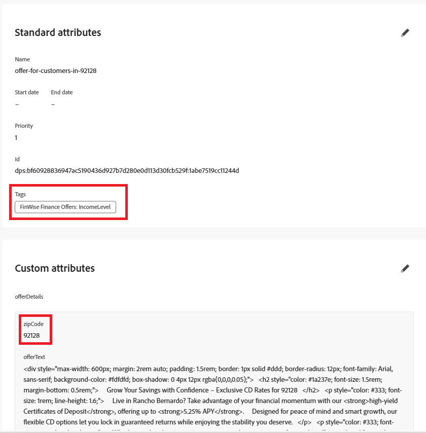

# Create Location-Based Offers with ZIP Code Targeting

Before creating the offers, the Offer Item schema was extended to include a new field: zipcode. This custom field enables each offer to be explicitly tagged with its target ZIP code, allowing for location-based filtering and ranking during decisioning.

With the schema updated, two personalized offers were created:

* Offer 1: "Flexible Investment Plans for Mira Mesa (92126)"
Tailored for young professionals and tech-focused residents in 92126, this offer promotes flexible investment options such as ETFs and mutual funds aimed at long-term growth. The zipcode field is set to 92126.

* Offer 2: "High-Yield CDs for Rancho Bernardo (92128)"
Targeting financially stable and retirement-ready individuals in 92128, this offer features high-yield Certificates of Deposit (CDs) with guaranteed returns. The zipcode field is set to 92128.

These offers are now enriched with location metadata, making them eligible for dynamic selection and ranking based on user profile ZIP codes in later steps.

The following screenshot shows the custom attributes added to the offer item schema.




## Offer for 92126

The offer text for offers in 92126 zip code

```html
<div style="max-width: 600px; margin: 2rem auto; padding: 1.5rem; border: 1px solid #ddd; border-radius: 12px; font-family: Arial, sans-serif; background-color: #f9f9f9; box-shadow: 0 4px 12px rgba(0,0,0,0.05);">   <h2 style="color: #1a237e; font-size: 1.5rem; margin-bottom: 0.5rem;">     Boost Your Financial Game with Smart Investment Options   </h2>   <p style="color: #333; font-size: 1rem; line-height: 1.6;">     In Mira Mesa (92126), ambition meets opportunity. Whether you're building wealth or just getting started, our     <strong>diversified investment plans</strong> — including <strong>tech-focused ETFs</strong> and     <strong>flexible mutual funds</strong> — are designed to grow with your goals.   </p>   <p style="color: #333; font-size: 1rem; line-height: 1.6;">     Enjoy expert guidance, low fees, and strategies built for busy professionals who want more from their money — without the hassle.   </p>   <a href="#start-investing" style="display: inline-block; margin-top: 1rem; background-color: #1a73e8; color: white; padding: 0.75rem 1.25rem; border-radius: 8px; text-decoration: none; font-weight: bold;">     Start Investing Smarter   </a> </div>
```


## Offer for 92128

The offer text for offers in 92128 zip code

``` html
<div style="max-width: 600px; margin: 2rem auto; padding: 1.5rem; border: 1px solid #ddd; border-radius: 12px; font-family: Arial, sans-serif; background-color: #fdfdfd; box-shadow: 0 4px 12px rgba(0,0,0,0.05);">   <h2 style="color: #1a237e; font-size: 1.5rem; margin-bottom: 0.5rem;">     Grow Your Savings with Confidence – Exclusive CD Rates for 92128   </h2>   <p style="color: #333; font-size: 1rem; line-height: 1.6;">     Live in Rancho Bernardo? Take advantage of your financial momentum with our <strong>high-yield Certificates of Deposit</strong>, offering up to <strong>5.25% APY</strong>.     Designed for peace of mind and smart growth, our flexible CD options let you lock in guaranteed returns while enjoying the stability you deserve.   </p>   <p style="color: #333; font-size: 1rem; line-height: 1.6;">     Whether you're planning retirement or simply securing your future, this offer is tailored for residents like you.   </p>   <a href="#explore-cd-options" style="display: inline-block; margin-top: 1rem; background-color: #1a73e8; color: white; padding: 0.75rem 1.25rem; border-radius: 8px; text-decoration: none; font-weight: bold;">     Explore CD Options   </a> </div>

```

## Generic Offer (Fallback offer)

The offer text for Generic offer, without any zip code associated with the offer

``` html
<div style="max-width: 600px; margin: 2rem auto; padding: 1.5rem; border: 1px solid #ddd; border-radius: 12px; font-family: Arial, sans-serif; background-color: #ffffff; box-shadow: 0 4px 12px rgba(0,0,0,0.05);">
  <h2 style="color: #1a237e; font-size: 1.5rem; margin-bottom: 0.5rem;">
    Invest Smarter: Build Wealth with Flexible Financial Plans
  </h2>
  <p style="color: #333; font-size: 1rem; line-height: 1.6;">
    Looking to take control of your financial future? Our flexible investment solutions are designed to meet a wide range of goals — from growing savings to planning for retirement.
    Choose from diversified mutual funds, ETFs, and professionally managed portfolios, all with expert guidance and minimal hassle.
  </p>
  <p style="color: #333; font-size: 1rem; line-height: 1.6;">
    Whether just starting out or optimizing an existing strategy, this offer provides the tools to invest with confidence — no matter where you live.
  </p>
  <a href="#explore-investment-plans" style="display: inline-block; margin-top: 1rem; background-color: #1a73e8; color: white; padding: 0.75rem 1.25rem; border-radius: 8px; text-decoration: none; font-weight: bold;">
    Explore Investment Plans
  </a>
</div>

```

Group these offers in a collection called **_GenericOffers_**

The offers are available to all visitors—meaning there are no strict eligibility constraints—then the ranking formula becomes critical for determining which offer should be shown based on profile context.
Since eligibility rules aren't filtering the offers, all three are treated as candidates.
The selection strategy retrieves all three.
The ranking formula scores them based on profile attributes (like zipcode and annualIncome) to pick the best one.
