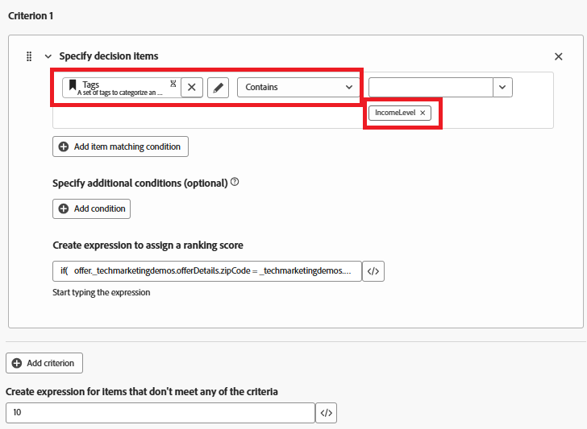

# Create Ranking formula

A ranking formula in Adobe Journey Optimizer is used during offer decisioning, specifically within a selection strategy to determine the priority order of eligible offers. The ranking formula comes into play after eligibility filtering, when multiple offers qualify for a given profile but only the top one (or few) should be presented based on business logic or profile context.

*   Log in to Journey Optimizer

*   Decisioning ->Strategy setup ->Ranking formulas ->Create formula

Ranking Formula 


A criterion in a ranking formula refers to a conditional rule used to assign a score to an offer. These criteria compare attributes from the offer and the profile or context to determine how relevant an offer is for a specific individual.


Criteria 1

This condition filters decision items (offers) **to include only** the offers tagged with "IncomeLevel."
These filtered offers will then proceed to the next step — such as ranking or delivery — based on additional logic you define.



The following expression is used to create the ranking score

``` pql

if(   offer._techmarketingdemos.offerDetails.zipCode = _techmarketingdemos.zipCode,   _techmarketingdemos.annualIncome / 1000 + 10000,   if(     not offer._techmarketingdemos.offerDetails.zipCode,     _techmarketingdemos.annualIncome / 1000,     -9999   ) )

```

What the Formula Does

*   If the offer has the same ZIP code as the user, give it a very high score so it gets picked first.

*   If the offer doesn't have a ZIP code at all (it's a general offer), give it a normal score based on the user's income.

*   If the offer has a different ZIP code than the user, give it a very low score so it's not selected.

This way, the system:

*   Always tries to show a ZIP-matching offer first,

*   Falls back to a general offer if no match is found, and avoids showing offers meant for other ZIP codes.


If an offer item does not meet any of the filter criteria (like not having the "IncomeLevel" tag), the offer receives a default ranking score of 10.


