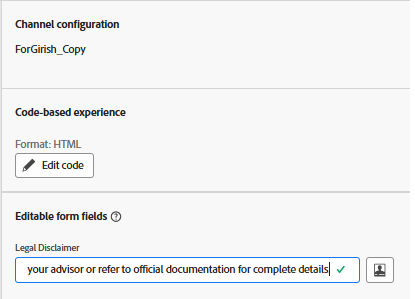

# Using Editable Form Fields in AJO Code-Based Experiences

In many marketing journeys, particularly in regulated industries, it's essential to include a legal disclaimer that can vary depending on the campaign, geography, or product. By using an [editable field](https://experienceleague.adobe.com/en/docs/journey-optimizer-learn/tutorials/channels/code-based-experience-channel/form-fields-in-code-based-experiences) directly in the AJO Personalization Editor, marketers and legal teams can maintain full control over the disclaimer text without involving developers or modifying decision logic.

This enables quick updates and ensures compliance across campaigns while leveraging decisioned content like offers.

## Insert editable field in personalization editor

- Open the campaign created in the earlier step. 
- Click _**Modify campaign**_
- Navigate to _**Content**_ tab
- Click on _**Edit code**_ and insert a editable field called legalDisclaimer with a default value  using the following syntax in the personalization editor

- `{{#inline "legalDisclaimer" name="Legal Disclaimer"}} Legal Disclaimer will go here {{/inline}}`

- Use the `{{{legalDisclaimer}}}` variable in the template as shown below

- 

- Marketers can easily edit the Legal Disclaimer field without having to open the personalization editor.
- 

## Publish the campaign

Activate the campaign to begin delivering personalized offers in real time.
