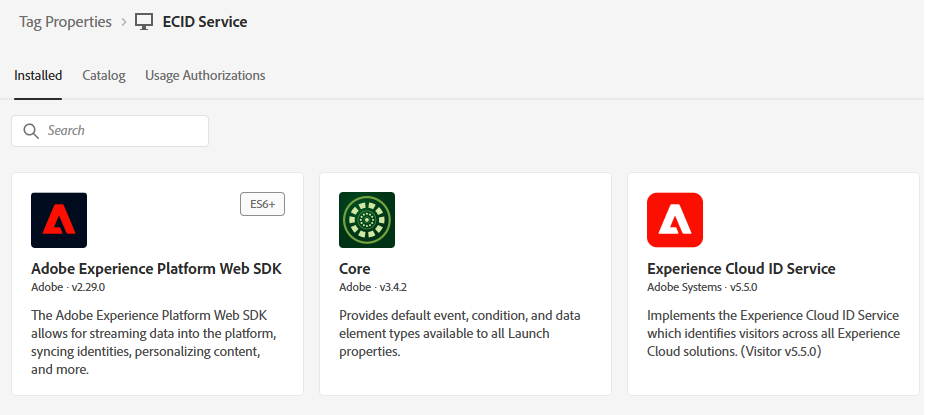

# Create Adobe Experience Platform tags

Experience Platform tags are configured on the web page to load the Adobe Experience Platform Web SDK, enabling the sendEvent API call to trigger personalized experiences. This setup ensures that the necessary client-side libraries are initialized correctly, allowing real-time interaction with Adobe Journey Optimizer for offer delivery.

1. Log in to Data Collection.
1. Click **[!UICONTROL Tags]** > **[!UICONTROL New Property]**.
1. Create an Adobe Experience Platform Tag called ECID Service.
1. Add the following extensions to the Tag:

    

1. Configure the Adobe Experience Platform Web SDK to use the correct environment and the Financial Advisors DataStream created in the previous tutorial

    

No additional configuration is needed for Adobe Client Data Layer and core extensions

## Create the data element

The ECID data element in Experience Platform tags is created solely for debugging and testing purposes. The data element allows developers to view the Experience Cloud ID assigned to a user's browser session, which can help validate identity stitching and ensure that the `sendEvent` calls are associated with the correct profile. This element is not required for personalization to function but is useful during implementation and QA


## Include AEP Tags in the HTML page

Build and publish the Adobe Experience Platform Tags.

When an AEP Tags property is published, Adobe gives you a script tag that you must place inside your HTML ``` <head>``` or at the bottom of the ``` <body>``` tags.

1. Go to your Tags (ECID Service) property.

1. Click Environments, then click the install icon of the environment you want (for example, Development, Staging, Production).

1. Note the embedded code. 

    This code needs to be placed just before the closing ```</body>``` tag in the HTML page.
