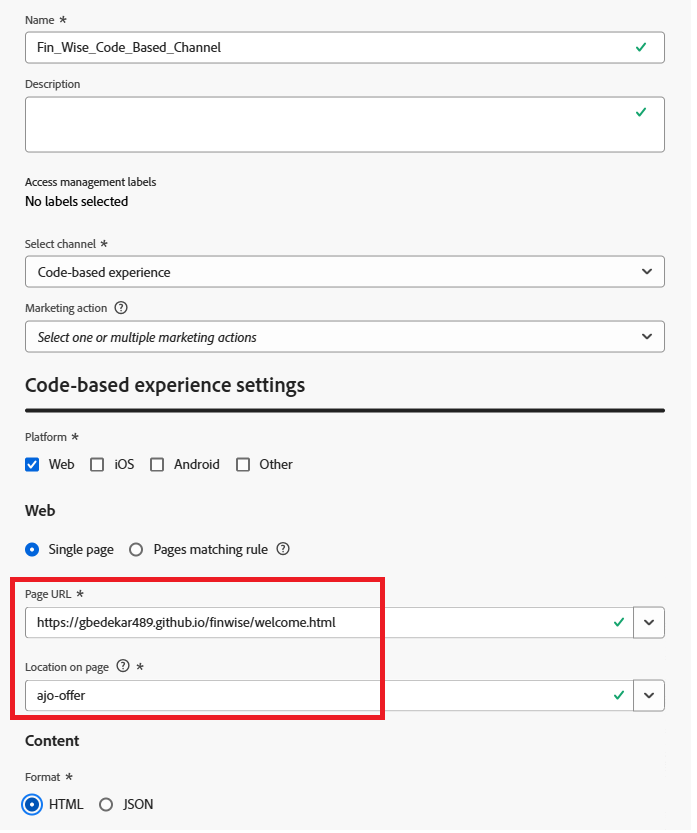

# Create a code-based experience channel

A code-based experience in Adobe Journey Optimizer (AJO) [!UICONTROL Decisioning] is a configuration that enables the delivery of personalized offers directly into a web page using client-side JavaScript. Instead of relying on predefined templates or visual layout tools, this approach gives developers full control over when and where offers are rendered using the Adobe Web SDK (`Alloy.js`).

