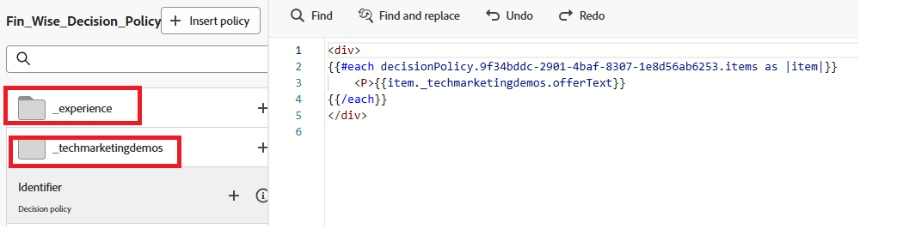

# Create a decision policy

Decision policies are containers for your offers that leverage the [!UICONTROL Decisioning] engine in order to pick the best content to deliver, depending on the audience.

1. In the personalization editor, click **[!UICONTROL Decison policy]** item in the left navigation, then click **[!UICONTROL Add decision policy]**.

    

1. Click **[!UICONTROL Add]** to select the selection strategy.

    

1. Click **[!UICONTROL Select fallback]** to select the fall back offer.
1. Click **[!UICONTROL Next]** to review the decision policy.
1. Click **[!UICONTROL Create]** to complete the process of creating the decison policy.

## Use the decision policy in the code editor

1. From the personalization editor, click **[!UICONTROL Insert policy]**. 

    The code corresponding to the decision policy is added.

    At this stage, you can include any required decision attributes directly within the code. These attributes are defined in the schema used by the Offers catalog. Standard attributes are organized under the `__experience` namespace, while any custom attributes specific to your organization are stored under the `_<imsOrg>` namespace.

    

    This code goes through a list of personalized offers chosen for the user and displays the text for each one on the web page. It shows the message (called `offerText`) from each offer inside a paragraph, so users can see their tailored content clearly.

    If no personalized offer is available, a fallback offer is shown to ensure the space isn't left blank.

1. Click **[!UICONTROL Save]**, then activate the campaign.
